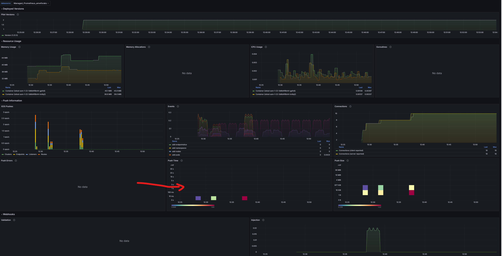

# Observability with Istio add-on for AKS

## Prep steps for creating and configuring AMW and AMG

### Enable Prometheus and Grafana

1) Create Azure Managed Workspace and Azure Managed Grafana 

2) Enable Prometheus and Grafana add-on for AKS
```bash
export amwrid=$(az monitor account show --resource-group infrarg --name amwforaks --query id -o tsv)
export amgrid=$(az grafana show --resource-group infrarg --name amgforaks --query id -o tsv)

az aks update --enable-azure-monitor-metrics --name aksistio1 --resource-group aksistiorg --azure-monitor-workspace-resource-id $amwrid --grafana-resource-id  $amgrid
```

### Setup Grafana Dashboards

Click 'Dashboard'  


on the far right side top, click 'New' --> Import
 

Enter 7645 under 'Find and import dashboards' and click Load.  Select 'Prometheus' AMW resource when asked and click 'Import'  

Now, back to 'Dashboard' on the left side, you should see the new dashboard imported. 

Review 
Push time is an interresting metric to watch.   


For list of dashboards, refer to https://grafana.com/grafana/dashboards?dataSource=prometheus

Check Filters on the left side. You can use Category to Azure for Azure specific metrics.

For Istio dashboards, refer to https://grafana.com/orgs/istio/dashboards

Review https://www.youtube.com/watch?v=CifKWSnX8C8  


### Enable log collection with Log Analytics

This collection is for AKS data plane (container logs) logs and not for AKS control plane logs. 

```bash
export lawrid=$(az monitor log-analytics workspace show --resource-group infrarg --name akscontainerinsightslogs --query id -o tsv)
az aks enable-addons --addon monitoring --name aksistio1 --resource-group aksistiorg --workspace-resource-id $lawrid
```


## Logging with Istio 


Telemtry API 


Enable envoy access logging for the entire mesh  
```bash
cat <<EOF | kubectl apply -n aks-istio-system -f -
apiVersion: telemetry.istio.io/v1
kind: Telemetry
metadata:
  name: mesh-logging-default
spec:
  accessLogging:
  - providers:
    - name: envoy
EOF
```

Enable envoy access logging for a specific namespace  
```bash
cat <<EOF | kubectl apply -f -
apiVersion: telemetry.istio.io/v1
kind: Telemetry
metadata:
  name: ns-logging-testns
  namespace: testns
spec:
  accessLogging:
  - providers:
    - name: envoy
EOF
```

Create a test namespace and a pod in the namespace.
```bash
k create ns testns
kubectl label namespace testns istio.io/rev=asm-1-22
k -n testns run netshoot --image=nicolaka/netshoot -- sh -c 'sleep 2000'
k create sa httpbin -n testns
k get pod -n testns
```

Create a service and a deployment in the test namespace.
```bash
kubectl apply -f - <<EOF
apiVersion: v1
kind: Service
metadata:
  name: httpbin
  namespace: testns
  labels:
    app: httpbin
    service: httpbin
spec:
  ports:
  - name: http
    port: 8000
    targetPort: 8080
  selector:
    app: httpbin
---
apiVersion: apps/v1
kind: Deployment
metadata:
  name: httpbin
  namespace: testns
spec:
  replicas: 1
  selector:
    matchLabels:
      app: httpbin
      version: v1
  template:
    metadata:
      labels:
        app: httpbin
        version: v1
    spec:
      serviceAccountName: httpbin
      containers:
      - image: docker.io/mccutchen/go-httpbin:v2.15.0
        imagePullPolicy: IfNotPresent
        name: httpbin
        ports:
        - containerPort: 8080
EOF
```


Check the output of the following command to see if the envoy access logs are being generated.  
```bash
k -n testns exec -it netshoot -- curl http://httpbin:8000/get
```


Create another namespace and a pod in the namespace.
```bash
k create ns testns2
kubectl label namespace testns2 istio.io/rev=asm-1-22
k -n testns2 run netshoot --image=nicolaka/netshoot -- sh -c 'sleep 2000'
k create sa httpbin -n testns2
k get pod -n testns
```

```bash
kubectl apply -f - <<EOF
apiVersion: v1
kind: Service
metadata:
  name: httpbin
  namespace: testns2
  labels:
    app: httpbin
    service: httpbin
spec:
  ports:
  - name: http
    port: 8000
    targetPort: 8080
  selector:
    app: httpbin
---
apiVersion: apps/v1
kind: Deployment
metadata:
  name: httpbin
  namespace: testns2
spec:
  replicas: 1
  selector:
    matchLabels:
      app: httpbin
      version: v1
  template:
    metadata:
      labels:
        app: httpbin
        version: v1
    spec:
      serviceAccountName: httpbin
      containers:
      - image: docker.io/mccutchen/go-httpbin:v2.15.0
        imagePullPolicy: IfNotPresent
        name: httpbin
        ports:
        - containerPort: 8080
EOF
```


```bash
k -n testns2 exec -it netshoot -- curl http://httpbin:8000/get
```

Compare log entries in Log Analytics for testns and testns2


Review logs in log analytics  

```
ContainerLogV2
| where TimeGenerated > ago(1h)
| where PodNamespace == "testns" and ContainerName == "istio-proxy" 
| order by TimeGenerated desc
| limit 10
```


## Metrics


### Preparation


```bash
kubectl get cm -n kube-system | grep ama

k create configmap ama-metrics-prometheus-config -n kube-system --from-file=prometheus-config

k logs deploy/ama-metrics -n kube-system
``` 

Understand the metrics being exposed by the envoy proxy. 

```bash
k -n testns exec netshoot -it -c istio-proxy -- pilot-agent request GET stats
k -n testns exec netshoot -it -c netshoot -- curl localhost:15000/stats
k -n testns exec netshoot -it -c netshoot -- curl localhost:15000/stats/prometheus
```

Issue a request and check the metrics again 

```bash
k -n testns exec -it netshoot -- curl http://httpbin:8000/get
```

```bash
k -n testns exec netshoot -it -c istio-proxy -- pilot-agent request GET stats  | grep istio_requests_total
k -n testns exec netshoot -it -c netshoot -- curl localhost:15000/stats/prometheus | grep istio_requests_total
```

Generally, Prometheus Operator use servicemonitor and podmonitor CRDs for scraping metrics. 

https://github.com/prometheus-operator/prometheus-operator/blob/main/Documentation/api.md  

Not created/needed for Azure Container Insights.    
```bash
k get servicemonitor -A
k get podmonitor -A
```

From a browser, accesss productpage
http://135.224.165.254/productpage

Send some requests to the productpage.   
```bash
curl --parallel --parallel-immediate --parallel-max 10 $(printf "http://135.224.165.254/productpage %.0s" {1..100})
```

In Grafana, check the metrics under 'Service' dashboard. 

Ensure that the Service is selected as 'productpage'.  


## Tracing


## Prep steps  


https://istio.io/latest/docs/ops/integrations/jaeger/#installation 

kubectl apply -f https://raw.githubusercontent.com/istio/istio/release-1.23/samples/addons/jaeger.yaml

wget https://raw.githubusercontent.com/istio/istio/release-1.23/samples/addons/jaeger.yaml

Change references from istio-system to aks-istio-system

kubectl apply -f jaeger.yaml

k get deploy -n aks-istio-system
k get svc -n aks-istio-system

Once Jaeger is installed, you will need to point Istio proxies to send traces to the deployment. 

istioctl dashboard jaeger -n aks-istio-system

k port-forward svc/httpbin -n testns 8080:8000

Open a browser and access http://localhost:8080/headers  


```bash
kubectl apply -f - <<EOF
apiVersion: telemetry.istio.io/v1
kind: Telemetry
metadata:
  name: ns-tracing-testns
  namespace: testns
spec:
  tracing:
    - providers:
        - name: "zipkin"
EOF
```

Validate the tracing configuration
```bash
k get cm istio-asm-1-22 -n aks-istio-system -o yaml
k get svc -n aks-istio-system
```

zipkin address should be set to zipkin.aks-istio-system:9411   

Open a browser and access http://localhost:8080/headers  
This should continue to display same output and there is no tracing headers.  


Define a gateway and virtual service for httpbin. Add a DNS entry for the gateway (if you own the domain or use curl commands with the IP address and host header)

```bash
kubectl apply -f - <<EOF
apiVersion: networking.istio.io/v1alpha3
kind: Gateway
metadata:
  name: httpbin-gateway
  namespace: testns
spec:
  selector:
    istio: aks-istio-ingressgateway-external
  servers:
  - port:
      number: 80
      name: http
      protocol: HTTP
    hosts:
    - tracingdemo.srinman.com
EOF
```

```bash
kubectl apply -f - <<EOF
apiVersion: networking.istio.io/v1alpha3
kind: VirtualService
metadata:
  name: httpbin
  namespace: testns
spec:
  hosts:
  - tracingdemo.srinman.com
  gateways:
  - httpbin-gateway
  http:
  - match:
    - uri:
        prefix: /
    route:
    - destination:
        host: httpbin
        port:
          number: 8000
EOF
```

Open a browser and access http://tracingdemo.srinman.com/headers


You can see that x-b3 zipkin headers are present and they are being sent to the jaeger.   


```bash
kubectl apply -f - <<EOF
apiVersion: telemetry.istio.io/v1
kind: Telemetry
metadata:
  name: ns-tracing-testns
  namespace: testns
spec:
  tracing:
    - providers:
        - name: "zipkin"
      randomSamplingPercentage: 100.00
EOF
```

istioctl dashboard jaeger -n aks-istio-system


```


## Kiali

Install Kiali

```bash
wget https://raw.githubusercontent.com/istio/istio/release-1.23/samples/addons/kiali.yaml
```

Change references from istio-system to aks-istio-system

k apply -f kiali.yaml

 
kubectl port-forward svc/kiali -n aks-istio-system 20001:20001


### Troubleshooting

Send some requests to the productpage.   
```bash
curl --parallel --parallel-immediate --parallel-max 10 $(printf "http://135.224.165.254/productpage %.0s" {1..100})
```

istioctl pc bootstrap -n testns deploy/httpbin -o json | jq .bootstrap.tracing


