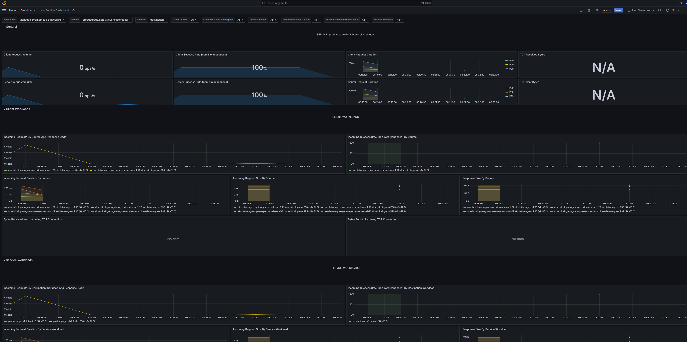
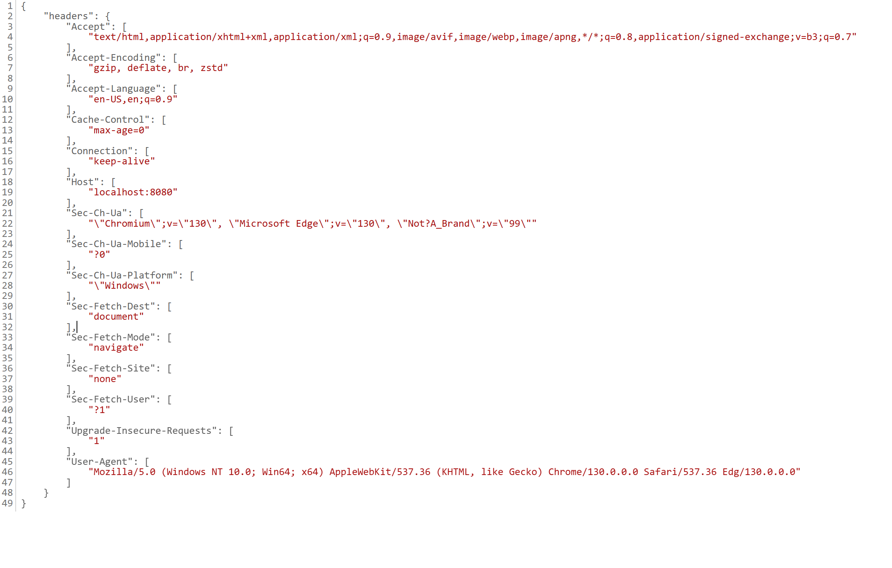

# Istio Observability Lab

## Overview

This lab demonstrates how to implement comprehensive observability for Istio service mesh using Azure Monitor, Grafana, and distributed tracing. You'll learn to monitor metrics, analyze logs, and trace requests across your microservices architecture.

## Learning Objectives

By the end of this lab, you will understand and implement:

1. **Azure Monitor Integration**: Setting up metrics collection infrastructure
2. **Prometheus Metrics Collection**: Understanding and viewing Istio service mesh metrics  
3. **Centralized Logging**: Envoy access logs and centralized log analysis with Azure Log Analytics
4. **Service Mesh Visualization**: Service topology and traffic flow analysis with Kiali
5. **Distributed Tracing**: Request tracing across services using Jaeger

## Architecture Overview

```
┌─────────────────────────────────────────────────────────────────┐
│                    Istio Observability Stack                   │
├─────────────────────────────────────────────────────────────────┤
│                                                                 │
│  ┌─────────────┐    ┌─────────────┐    ┌─────────────┐         │
│  │   Grafana   │    │   Jaeger    │    │    Kiali    │         │
│  │ (Metrics &  │    │ (Tracing)   │    │ (Topology)  │         │
│  │ Dashboards) │    │             │    │             │         │
│  └─────────────┘    └─────────────┘    └─────────────┘         │
│         │                   │                   │              │
│         ▼                   ▼                   ▼              │
│  ┌─────────────────────────────────────────────────────────┐   │
│  │              Azure Monitor Workspace                   │   │
│  │            (Prometheus + Log Analytics)                │   │
│  └─────────────────────────────────────────────────────────┘   │
│                              │                                 │
│                              ▼                                 │
│  ┌─────────────────────────────────────────────────────────┐   │
│  │                   Istio Service Mesh                   │   │
│  │  ┌─────────────┐  ┌─────────────┐  ┌─────────────┐    │   │
│  │  │   Service   │  │   Service   │  │   Service   │    │   │
│  │  │  + Envoy    │  │  + Envoy    │  │  + Envoy    │    │   │
│  │  │   Proxy     │  │   Proxy     │  │   Proxy     │    │   │
│  │  └─────────────┘  └─────────────┘  └─────────────┘    │   │
│  └─────────────────────────────────────────────────────────┘   │
└─────────────────────────────────────────────────────────────────┘
```

---

## Environment Preparation and Cleanup

### Step 1: Verify Prerequisites

**Check your AKS cluster and Istio installation:**

```bash
# Verify AKS cluster is running
kubectl get nodes

# Verify Istio control plane is installed
kubectl get pods -n aks-istio-system

# Check Istio revision
kubectl get namespace -l istio.io/rev --show-labels

# Verify Istio ingress gateway
kubectl get svc -n aks-istio-ingress
```

### Step 2: Clean Up Existing Test Deployments

**Remove any existing test applications and namespaces:**

```bash
# Clean up common test namespaces that might exist
kubectl delete namespace bookinfo testns testns2 --ignore-not-found=true

# Clean up any existing observability tools
kubectl delete -f https://raw.githubusercontent.com/istio/istio/release-1.23/samples/addons/jaeger.yaml --ignore-not-found=true
kubectl delete -f https://raw.githubusercontent.com/istio/istio/release-1.23/samples/addons/kiali.yaml --ignore-not-found=true

# Wait for namespaces to be fully deleted
echo "Waiting for namespaces to be deleted..."
while kubectl get namespace bookinfo testns testns2 2>/dev/null | grep -q Terminating; do
  echo "Still deleting namespaces..."
  sleep 10
done
echo "Cleanup complete!"
```

### Step 3: Verify Clean Environment

**Confirm the environment is ready:**

```bash
# Verify test namespaces are gone
kubectl get namespace | grep -E "(bookinfo|testns)"
# Expected: No output

# Check for any running port-forwards and kill them
pkill -f "kubectl port-forward" || echo "No existing port-forwards found"

# Verify Azure Monitor metrics addon status
az aks show --name aksistio4 --resource-group aksistio4rg --query "azureMonitorProfile.metrics.enabled" -o tsv

# Check if ama-metrics is running
kubectl get pods -n kube-system | grep ama-metrics
```

### Step 4: Set Environment Variables

**Set up commonly used variables for the lab:**

```bash
# Set cluster information
export CLUSTER_NAME="aksistio4"
export RESOURCE_GROUP="aksistio4rg"
export INFRA_RG="infrarg"
export AMW_NAME="amwforaks"
export AMG_NAME="amgforaks"

# Verify Azure resources exist
echo "Verifying Azure resources..."
az aks show --name $CLUSTER_NAME --resource-group $RESOURCE_GROUP --query "name" -o tsv
az monitor account show --resource-group $INFRA_RG --name $AMW_NAME --query "name" -o tsv
az grafana show --resource-group $INFRA_RG --name $AMG_NAME --query "name" -o tsv

echo "✅ Environment preparation complete!"
```

**Expected Output:**
```
✅ Environment preparation complete!
aksistio4
amwforaks
amgforaks
```

---

## Lab Exercise 1: Setting Up Azure Monitor Integration

### Prerequisites

Ensure you have the following Azure resources:
- Azure Monitor Workspace (AMW)
- Azure Managed Grafana (AMG)
- AKS cluster with Istio service mesh

### Step 1: Enable Prometheus and Grafana Integration

**Get the resource IDs for your monitoring infrastructure:**

```bash
export amwrid=$(az monitor account show --resource-group infrarg --name amwforaks --query id -o tsv)
export amgrid=$(az grafana show --resource-group infrarg --name amgforaks --query id -o tsv)

# Verify the resource IDs
echo "Azure Monitor Workspace ID: $amwrid"
echo "Azure Managed Grafana ID: $amgrid"
```

**Enable Azure Monitor metrics on your AKS cluster:**

```bash
az aks update \
  --enable-azure-monitor-metrics \
  --name aksistio4 \
  --resource-group aksistio4rg \
  --azure-monitor-workspace-resource-id $amwrid \
  --grafana-resource-id $amgrid
```

**Expected Result**: Azure Monitor metrics collection is enabled, and your cluster will start sending Prometheus-compatible metrics to Azure Monitor Workspace.

### Step 2: Configure Grafana Dashboards

**Access Azure Managed Grafana:**

1. Navigate to your Azure Managed Grafana instance in the Azure portal
2. Click **Endpoint** to open Grafana

**Import Kubernetes Dashboard:**

1. Click **Dashboard** in the left sidebar
2. Click **New** → **Import** in the top right
3. Enter dashboard ID: `7645`
4. Click **Load**
5. Select your Azure Monitor Workspace as the Prometheus data source
6. Click **Import**

**Import Istio-specific dashboards:**

For comprehensive Istio monitoring, import these additional dashboards:

- **Istio Service Dashboard**: ID `7636`
- **Istio Workload Dashboard**: ID `7630` 
- **Istio Performance Dashboard**: ID `11829`

---

## Lab Exercise 2: Prometheus Metrics Collection

### Understanding Istio Metrics

Istio automatically generates metrics for:
- **Request rates, latencies, and error rates**
- **Service-to-service communication**
- **Workload performance**
- **Control plane health**

### Step 1: Deploy Sample Application for Metrics

**Deploy the Bookinfo application for comprehensive metrics testing:**

```bash
# Create and label namespace
kubectl create namespace bookinfo
kubectl label namespace bookinfo istio.io/rev=asm-1-25

# Deploy bookinfo application
kubectl apply -f https://raw.githubusercontent.com/istio/istio/release-1.18/samples/bookinfo/platform/kube/bookinfo.yaml -n bookinfo

# Wait for pods to be ready
kubectl wait --for=condition=Ready pod -l app=productpage -n bookinfo --timeout=120s

# Verify sidecars are injected (should show 2/2 containers)
kubectl get pods -n bookinfo
```

**Create Gateway and VirtualService for external access:**

```bash
kubectl apply -f - <<EOF
apiVersion: networking.istio.io/v1alpha3
kind: Gateway
metadata:
  name: bookinfo-gateway
  namespace: bookinfo
spec:
  selector:
    istio: aks-istio-ingressgateway-external
  servers:
  - port:
      number: 80
      name: http
      protocol: HTTP
    hosts:
    - "*"
---
apiVersion: networking.istio.io/v1alpha3
kind: VirtualService
metadata:
  name: bookinfo
  namespace: bookinfo
spec:
  hosts:
  - "*"
  gateways:
  - bookinfo-gateway
  http:
  - match:
    - uri:
        exact: /productpage
    - uri:
        prefix: /static
    - uri:
        exact: /login
    - uri:
        exact: /logout
    - uri:
        prefix: /api/v1/products
    route:
    - destination:
        host: productpage
        port:
          number: 9080
EOF
```

### Step 1.5: Configure Azure Monitor Managed Prometheus for Istio Metrics

Before verifying Istio proxy metrics, we need to configure Azure Monitor Managed Prometheus to properly scrape Istio metrics. This requires creating specific configmaps in the `kube-system` namespace.

#### Azure Monitor Managed Prometheus ConfigMaps Overview

Azure Monitor Managed Prometheus supports four different configmaps that provide scrape configuration and settings for the metrics add-on. All configmaps must be applied to the `kube-system` namespace.

> ⚠️ **Important**: None of these configmaps exist by default when Managed Prometheus is enabled. You must deploy the configmaps you need, and AMA-Metrics pods will restart in 2-3 minutes to apply the new configuration.

| ConfigMap Name | Purpose | Scope | Use Case |
|---|---|---|---|
| **ama-metrics-settings-configmap** | General addon settings and configuration | Cluster-wide | - Enable/disable default scrape targets<br>- Configure pod annotation-based scraping<br>- Set metric keep-lists and scrape intervals<br>- Control cluster alias and debug mode |
| **ama-metrics-prometheus-config** | Custom Prometheus scrape jobs for cluster-level services | Replica (singleton) | - Add custom scrape jobs for any services<br>- **✅ Sufficient for Istio metrics collection**<br>- Configure service discovery and relabeling<br>- Scrape both mesh and proxy metrics |
| **ama-metrics-prometheus-config-node** | Custom Prometheus scrape jobs for node-level targets | DaemonSet (per Linux node) | - Scrape node-specific services<br>- Access services using `$NODE_IP` variable<br>- Collect per-node metrics |
| **ama-metrics-prometheus-config-node-windows** | Custom Prometheus scrape jobs for Windows node-level targets | DaemonSet (per Windows node) | - Scrape Windows node-specific services<br>- Access services using `$NODE_IP` variable<br>- Collect per-Windows-node metrics |

**For Istio observability:**
- **Primary**: `ama-metrics-prometheus-config` - **This single configmap is sufficient** to collect all Istio metrics including `istio_requests_total`, mesh metrics, and proxy metrics
- **Optional**: `ama-metrics-settings-configmap` - Only needed if you want to customize default scrape settings or enable additional features like pod annotation-based scraping

> 💡 **Key Insight**: Based on testing, the `ama-metrics-prometheus-config` configmap with proper Kubernetes service discovery can successfully scrape Istio metrics from istio-proxy containers without requiring pod annotation-based scraping configuration.

**Step 1.5.1: Enable Pod Annotation-Based Scraping**

Azure Monitor Managed Prometheus can automatically discover and scrape metrics from pods with specific annotations. Create the settings configmap to enable this feature:

```bash
# Create the ama-metrics-settings-configmap to enable pod annotation scraping for istio-system namespace
kubectl apply -f - <<EOF
apiVersion: v1
kind: ConfigMap
metadata:
  name: ama-metrics-settings-configmap
  namespace: kube-system
data:
  schema-version: v1
  config-version: 1.0.0
  pod-annotation-based-scraping: |-
    podannotationnamespaceregex = "istio-system|aks-istio-ingress|bookinfo"
  default-scrape-settings-enabled: |-
    kubelet = true
    coredns = false
    cadvisor = true
    kubeproxy = false
    apiserver = false
    kubestate = true
    nodeexporter = true
    windowsexporter = false
    windowskubeproxy = false
    kappiebasic = true
    prometheuscollectorhealth = false
  default-targets-metrics-keep-list: |-
    kubelet = ""
    coredns = ""
    cadvisor = ""
    kubeproxy = ""
    apiserver = ""
    kubestate = ""
    nodeexporter = ""
    windowsexporter = ""
    windowskubeproxy = ""
    kappiebasic = ""
    prometheuscollectorhealth = ""
    minimalingestionprofile = true
  default-targets-scrape-interval-settings: |-
    kubelet = "30s"
    coredns = "30s"
    cadvisor = "30s"
    kubeproxy = "30s"
    apiserver = "30s"
    kubestate = "30s"
    nodeexporter = "30s"
    windowsexporter = "30s"
    windowskubeproxy = "30s"
    kappiebasic = "30s"
    prometheuscollectorhealth = "30s"
    podannotations = "30s"
EOF
```

**Step 1.5.2: Create Custom Prometheus Scrape Configuration**

Create a custom scrape configuration to collect Istio-specific metrics:

```bash
# Create prometheus scrape config for Istio metrics
kubectl apply -f - <<EOF
apiVersion: v1
kind: ConfigMap
metadata:
  name: ama-metrics-prometheus-config
  namespace: kube-system
data:
  prometheus-config: |
    global:
      scrape_interval: 30s
    scrape_configs:
    - job_name: 'istio-mesh'
      kubernetes_sd_configs:
      - role: endpoints
        namespaces:
          names:
          - istio-system
          - aks-istio-ingress
          - bookinfo
      relabel_configs:
      - source_labels: [__meta_kubernetes_service_name, __meta_kubernetes_endpoint_port_name]
        action: keep
        regex: istio-proxy;http-monitoring
      - source_labels: [__meta_kubernetes_service_annotation_prometheus_io_scrape]
        action: keep
        regex: true
      - source_labels: [__meta_kubernetes_service_annotation_prometheus_io_path]
        action: replace
        target_label: __metrics_path__
        regex: (.+)
      - source_labels: [__address__, __meta_kubernetes_service_annotation_prometheus_io_port]
        action: replace
        regex: ([^:]+)(?::\d+)?;(\d+)
        replacement: \$1:\$2
        target_label: __address__
      - action: labelmap
        regex: __meta_kubernetes_service_label_(.+)
      - source_labels: [__meta_kubernetes_namespace]
        action: replace
        target_label: kubernetes_namespace
      - source_labels: [__meta_kubernetes_service_name]
        action: replace
        target_label: kubernetes_name
    
    - job_name: 'istio-proxy'
      kubernetes_sd_configs:
      - role: pod
        namespaces:
          names:
          - istio-system
          - aks-istio-ingress
          - bookinfo
      relabel_configs:
      - source_labels: [__meta_kubernetes_pod_container_name]
        action: keep
        regex: istio-proxy
      - source_labels: [__meta_kubernetes_pod_annotation_prometheus_io_scrape]
        action: keep
        regex: true
      - source_labels: [__meta_kubernetes_pod_annotation_prometheus_io_path]
        action: replace
        target_label: __metrics_path__
        regex: (.+)
      - source_labels: [__address__, __meta_kubernetes_pod_annotation_prometheus_io_port]
        action: replace
        regex: ([^:]+)(?::\d+)?;(\d+)
        replacement: \$1:\$2
        target_label: __address__
      - action: labelmap
        regex: __meta_kubernetes_pod_label_(.+)
      - source_labels: [__meta_kubernetes_namespace]
        action: replace
        target_label: kubernetes_namespace
      - source_labels: [__meta_kubernetes_pod_name]
        action: replace
        target_label: kubernetes_pod_name
      metric_relabel_configs:
      - source_labels: [__name__]
        regex: 'istio_.*'
        action: keep
EOF
```

**Step 1.5.3: Verify AMA-Metrics Pods Restart**

After creating the configmaps, the AMA-Metrics pods will automatically restart to pick up the new configuration:

```bash
# Watch for AMA-Metrics pods to restart (this may take 2-3 minutes)
echo "Waiting for AMA-Metrics pods to restart with new configuration..."
kubectl get pods -n kube-system -l app.kubernetes.io/name=ama-metrics -w

# Verify the configmaps are created
kubectl get configmap -n kube-system | grep ama-metrics

# Check AMA-Metrics logs for configuration loading
kubectl logs -n kube-system -l app.kubernetes.io/name=ama-metrics -c prometheus-collector --tail=20
```

**Step 1.5.4: Verify Prometheus Annotations on Istio Pods**

Ensure that Istio pods have the correct Prometheus annotations for scraping:

```bash
# Check bookinfo pods for prometheus annotations
kubectl get pods -n bookinfo -o yaml | grep -A 5 -B 5 "prometheus.io"

# Verify istio-proxy containers have the scrape annotations
kubectl describe pods -n bookinfo | grep -A 10 -B 10 "prometheus.io"
```

The key annotations that should be present are:
- `prometheus.io/scrape: "true"`
- `prometheus.io/path: "/stats/prometheus"`
- `prometheus.io/port: "15020"`

**Step 1.5.5: Important Configuration Notes**

⚠️ **Important**: None of the four configmaps (`ama-metrics-settings-configmap`, `ama-metrics-prometheus-config`, `ama-metrics-prometheus-config-node`, `ama-metrics-prometheus-config-node-windows`) exist by default when Managed Prometheus is enabled. 

The AMA-Metrics pods will automatically:
1. Detect the new configmaps in the `kube-system` namespace
2. Restart in 2-3 minutes to apply the new configuration
3. Begin scraping metrics according to the new settings

### Step 2: Verify Istio Proxy Metrics Generation

**Step 2.1: Check Basic Envoy Admin Interface**

```bash
# Check if Envoy admin interface is accessible
kubectl -n bookinfo exec deployment/productpage-v1 -c istio-proxy -- pilot-agent request GET /ready

# Check basic stats endpoint
kubectl -n bookinfo exec deployment/productpage-v1 -c istio-proxy -- pilot-agent request GET /stats | head -10

# Check Prometheus metrics endpoint
kubectl -n bookinfo exec deployment/productpage-v1 -c istio-proxy -- pilot-agent request GET /stats/prometheus | head -10
```

**Step 2.2: Generate Traffic and Verify Metrics Appear**

```bash
# Get the ingress IP
export INGRESS_IP=$(kubectl get svc -n aks-istio-ingress aks-istio-ingressgateway-external -o jsonpath='{.status.loadBalancer.ingress[0].ip}')
echo "Ingress IP: $INGRESS_IP"

# Generate traffic to create request metrics
for i in {1..10}; do
  curl -s "http://$INGRESS_IP/productpage" > /dev/null
  echo "Request $i sent"
  sleep 1
done

# Now verify istio_requests_total metrics are generated
kubectl -n bookinfo exec deployment/productpage-v1 -c istio-proxy -- pilot-agent request GET /stats/prometheus | grep istio_requests_total
# Expected result: Multiple lines showing request metrics

# TROUBLESHOOTING: If no output above, try these steps:

# 1. First verify the ingress IP is set correctly
echo "Checking INGRESS_IP: $INGRESS_IP"
if [ -z "$INGRESS_IP" ]; then
  echo "INGRESS_IP not set! Setting it now..."
  export INGRESS_IP=$(kubectl get svc -n aks-istio-ingress aks-istio-ingressgateway-external -o jsonpath='{.status.loadBalancer.ingress[0].ip}')
  echo "INGRESS_IP set to: $INGRESS_IP"
fi

# 2. Verify the gateway and virtualservice are working
kubectl get gateway,virtualservice -n bookinfo

# 3. Test direct access to productpage
curl -v "http://$INGRESS_IP/productpage" | head -20

# 4. Generate more traffic with verbose output
echo "Generating additional traffic..."
for i in {1..5}; do
  response=$(curl -s -w "%{http_code}" "http://$INGRESS_IP/productpage" -o /dev/null)
  echo "Request $i - HTTP Status: $response"
  sleep 2
done

# 5. Check if ANY Istio metrics exist (not just requests_total)
echo "Checking for any Istio metrics..."
kubectl -n bookinfo exec deployment/productpage-v1 -c istio-proxy -- pilot-agent request GET /stats/prometheus | grep "istio_" | head -10

# 6. Check Envoy stats to see if traffic is being processed
echo "Checking Envoy listener stats..."
kubectl -n bookinfo exec deployment/productpage-v1 -c istio-proxy -- pilot-agent request GET /stats | grep -E "(downstream_|upstream_)" | head -5

# 7. Verify sidecar injection is working
kubectl get pods -n bookinfo -o jsonpath='{range .items[*]}{.metadata.name}{"\t"}{.spec.containers[*].name}{"\n"}{end}'

# 8. Try the command again after traffic generation
echo "Retrying istio_requests_total check..."
kubectl -n bookinfo exec deployment/productpage-v1 -c istio-proxy -- pilot-agent request GET /stats/prometheus | grep istio_requests_total

# Check for additional Istio metrics
kubectl -n bookinfo exec deployment/productpage-v1 -c istio-proxy -- pilot-agent request GET /stats/prometheus | grep -E "(istio_request_duration|istio_tcp_connections_opened_total)" | head -5
```

**Step 2.3: Verify Internal Service-to-Service Metrics**

```bash
# Generate internal traffic between services
kubectl -n bookinfo exec deployment/productpage-v1 -c productpage -- curl -s http://reviews:9080/reviews/0
kubectl -n bookinfo exec deployment/productpage-v1 -c productpage -- curl -s http://details:9080/details/0

# Check for outbound metrics from productpage
kubectl -n bookinfo exec deployment/productpage-v1 -c istio-proxy -- curl -s localhost:15000/stats/prometheus | grep istio_requests_total | grep reviews
kubectl -n bookinfo exec deployment/productpage-v1 -c istio-proxy -- curl -s localhost:15000/stats/prometheus | grep istio_requests_total | grep details
```

### Step 3: Verify Azure Monitor Metrics Scraping

**Step 3.1: Check Azure Monitor Addon Status**

```bash
# Verify Azure Monitor metrics addon is enabled
az aks show --name aksistio4 --resource-group aksistio4rg --query "azureMonitorProfile.metrics.enabled" -o tsv
# Expected result: true

# Check if ama-metrics pods are running
kubectl get pods -n kube-system | grep ama-metrics
# Expected result: ama-metrics pods in Running state

# Verify Azure Monitor configuration
kubectl get configmap -n kube-system | grep ama
```

**Step 3.2: Check ama-metrics Scraping Logs**

```bash
# Check recent logs for successful metric collection
kubectl logs deployment/ama-metrics -n kube-system --tail=20

# Look for errors in scraping
kubectl logs deployment/ama-metrics -n kube-system --tail=100 | grep -i error

# Check for successful scraping messages
kubectl logs deployment/ama-metrics -n kube-system --tail=100 | grep -i "successfully\|collected\|scraped"
```

**Step 3.3: Verify Metrics Targets Configuration**

```bash
# Check what targets ama-metrics is scraping
kubectl logs deployment/ama-metrics -n kube-system --tail=200 | grep -E "(target|endpoint|scrape)"

# Verify ama-metrics configuration
kubectl get configmap ama-metrics-settings-configmap -n kube-system -o yaml
```

**Step 3.4: Test Direct Metrics Collection**

```bash
# Check if ama-metrics can access the metrics endpoint
kubectl -n kube-system exec deployment/ama-metrics -- curl -s http://productpage.bookinfo.svc.cluster.local:15000/stats/prometheus | grep istio_requests_total | head -5
# Note: This might not work due to service mesh policies, but worth checking

# Alternative: Check if metrics are being exposed on the expected port
kubectl get pods -n bookinfo -o wide
kubectl get svc -n bookinfo
```

### Step 4: Verify Metrics in Azure Monitor Workspace

**Step 4.1: Access Azure Monitor Workspace**

```bash
# Get your Azure Monitor Workspace details
export amwrid=$(az monitor account show --resource-group infrarg --name amwforaks --query id -o tsv)
echo "Azure Monitor Workspace ID: $amwrid"

# Get the query endpoint URL
az monitor account show --resource-group infrarg --name amwforaks --query "metrics.prometheusQueryEndpoint" -o tsv
```

**Step 4.2: Test Prometheus Query API**

```bash
# Get access token for Azure Monitor
export ACCESS_TOKEN=$(az account get-access-token --resource https://prometheus.monitor.azure.com --query accessToken -o tsv)

# Test basic connectivity to Prometheus endpoint
export AMW_ENDPOINT=$(az monitor account show --resource-group infrarg --name amwforaks --query "metrics.prometheusQueryEndpoint" -o tsv)
echo "Prometheus endpoint: $AMW_ENDPOINT"

# Test query for basic metrics
curl -H "Authorization: Bearer $ACCESS_TOKEN" \
  -G "$AMW_ENDPOINT/api/v1/query" \
  --data-urlencode 'query=up' | jq .

# Test query for Istio metrics
curl -H "Authorization: Bearer $ACCESS_TOKEN" \
  -G "$AMW_ENDPOINT/api/v1/query" \
  --data-urlencode 'query=istio_requests_total' | jq .
```

**Step 4.3: Verify Metrics in Azure Portal**

```bash
# Navigate to Azure Portal → Monitor → Workspaces → [Your AMW] → Metrics Explorer
# Run these queries in the Azure Portal Metrics Explorer:

# Query 1: Check if any metrics exist
# up

# Query 2: Check for Istio request metrics
# istio_requests_total

# Query 3: Check metrics with specific labels
# istio_requests_total{destination_service_name="productpage"}
```

**Expected Results for Azure Monitor Workspace:**
- `up` query should return targets with value 1 (indicating successful scraping)
- `istio_requests_total` should return metrics with various labels
- Metrics should have recent timestamps (within last few minutes)

### Step 5: Verify Metrics in Grafana

**Step 5.1: Test Grafana Data Source Connection**

```bash
# Get Grafana details
export amgrid=$(az grafana show --resource-group infrarg --name amgforaks --query id -o tsv)
echo "Azure Managed Grafana ID: $amgrid"

# Get Grafana endpoint
az grafana show --resource-group infrarg --name amgforaks --query "properties.endpoint" -o tsv
```

**Manual Steps in Grafana UI:**

1. **Access Grafana**: Navigate to your Azure Managed Grafana endpoint
2. **Check Data Source**: 
   - Go to Configuration → Data Sources
   - Find "Azure Monitor Workspace" data source
   - Click "Test" to verify connection
   - Expected result: "Data source is working"

**Step 5.2: Test Basic Queries in Grafana Explore**

1. **Open Grafana Explore**: Click the compass icon
2. **Select Azure Monitor Workspace** as data source
3. **Test basic connectivity**:
   ```promql
   up
   ```
   Expected result: Should show metrics with value 1

4. **Test Istio metrics**:
   ```promql
   istio_requests_total
   ```
   Expected result: Should show request metrics with labels

5. **Test specific service metrics**:
   ```promql
   istio_requests_total{destination_service_name="productpage"}
   ```

**Step 5.3: Verify Dashboard Data**

1. **Import Istio Dashboard**: Use ID `7636` for Istio Service Dashboard
2. **Configure Dashboard**:
   - Set data source to Azure Monitor Workspace
   - Set time range to "Last 15 minutes"
   - Select service "productpage" from dropdown

3. **Generate More Traffic** (if no data appears):
   ```bash
   # Generate continuous traffic
   for i in {1..50}; do
     curl -s "http://$INGRESS_IP/productpage" > /dev/null
     echo "Request $i completed"
     sleep 2
   done
   ```

**Step 5.4: Troubleshoot Grafana Issues**

```bash
# If dashboard shows "No data":

# 1. Check time range - set to last 15-30 minutes
# 2. Verify service selection - choose "productpage"
# 3. Generate more traffic:
curl --parallel --parallel-immediate --parallel-max 5 $(printf "http://$INGRESS_IP/productpage %.0s" {1..25})

# 4. Test individual queries in Explore:
# - istio_requests_total
# - rate(istio_requests_total[5m])
# - sum(rate(istio_requests_total[5m])) by (destination_service_name)
```

### Step 6: Complete Pipeline Validation

**Validate the entire metrics pipeline with this checklist:**

```bash
# 1. Istio Proxy Metrics Generation ✓
echo "Step 1: Checking Istio proxy metrics..."
kubectl -n bookinfo exec deployment/productpage-v1 -c istio-proxy -- curl -s localhost:15000/stats/prometheus | grep istio_requests_total | wc -l

# 2. Azure Monitor Scraping ✓ 
echo "Step 2: Checking Azure Monitor scraping..."
kubectl logs deployment/ama-metrics -n kube-system --tail=10 | grep -i error || echo "No recent errors found"

# 3. Azure Monitor Workspace Availability ✓
echo "Step 3: Testing Azure Monitor Workspace..."
curl -H "Authorization: Bearer $(az account get-access-token --resource https://prometheus.monitor.azure.com --query accessToken -o tsv)" \
  -G "$(az monitor account show --resource-group infrarg --name amwforaks --query "metrics.prometheusQueryEndpoint" -o tsv)/api/v1/query" \
  --data-urlencode 'query=up' | jq '.data.result | length'

# 4. Grafana Connectivity ✓
echo "Step 4: Grafana - manual verification required in UI"
echo "  - Check data source connection"
echo "  - Test query: istio_requests_total"
echo "  - Verify dashboard shows data"

echo "Pipeline validation complete!"
```

### Step 7: Key Metrics to Monitor

**Essential Grafana queries for Istio metrics:**

```promql
# Request rate by service
sum(rate(istio_requests_total[5m])) by (destination_service_name)

# Success rate
sum(rate(istio_requests_total{response_code!~"5.*"}[5m])) / sum(rate(istio_requests_total[5m]))

# P99 latency
histogram_quantile(0.99, sum(rate(istio_request_duration_milliseconds_bucket[5m])) by (le))

# Error rate by service
sum(rate(istio_requests_total{response_code=~"5.*"}[5m])) by (destination_service_name) / sum(rate(istio_requests_total[5m])) by (destination_service_name)

# Incoming requests to productpage
sum(rate(istio_requests_total{destination_service_name="productpage"}[5m]))
```

### Step 8: Enable Container Insights (Optional)

**For additional container and node-level monitoring:**

```bash
export lawrid=$(az monitor log-analytics workspace show --resource-group infrarg --name akscontainerinsightslogs --query id -o tsv)

az aks enable-addons \
  --addon monitoring \
  --name aksistio4 \
  --resource-group aksistio4rg \
  --workspace-resource-id $lawrid
```

**Note**: This enables container logs collection for the AKS data plane (not control plane logs). This complements the Istio metrics you've just configured by providing additional container and node-level insights.

---

## Lab Exercise 3: Implementing Centralized Logging

Istio uses Envoy proxies to generate detailed access logs. The Telemetry API allows you to configure logging at different scopes:

- **Mesh-wide**: Apply logging to all services
- **Namespace-level**: Apply logging to specific namespaces
- **Service-level**: Apply logging to individual services

### Step 1: Enable Mesh-Wide Access Logging

**Apply logging configuration for the entire service mesh:**

```bash
kubectl apply -f - <<EOF
apiVersion: telemetry.istio.io/v1
kind: Telemetry
metadata:
  name: mesh-logging-default
  namespace: aks-istio-system
spec:
  accessLogging:
  - providers:
    - name: envoy
EOF
```

### Step 2: Create Test Environment

**Create the first test namespace:**

```bash
kubectl create namespace testns
kubectl label namespace testns istio.io/rev=asm-1-25

# Create a test pod for making requests
kubectl -n testns run netshoot --image=nicolaka/netshoot -- sh -c 'sleep 2000'

# Create a service account
kubectl create serviceaccount httpbin -n testns
```

**Deploy httpbin service in testns:**

```bash
kubectl apply -f - <<EOF
apiVersion: v1
kind: Service
metadata:
  name: httpbin
  namespace: testns
  labels:
    app: httpbin
    service: httpbin
spec:
  ports:
  - name: http
    port: 8000
    targetPort: 8080
  selector:
    app: httpbin
---
apiVersion: apps/v1
kind: Deployment
metadata:
  name: httpbin
  namespace: testns
spec:
  replicas: 1
  selector:
    matchLabels:
      app: httpbin
      version: v1
  template:
    metadata:
      labels:
        app: httpbin
        version: v1
    spec:
      serviceAccountName: httpbin
      containers:
      - image: docker.io/mccutchen/go-httpbin:v2.15.0
        imagePullPolicy: IfNotPresent
        name: httpbin
        ports:
        - containerPort: 8080
EOF
```

### Step 3: Configure Namespace-Specific Logging

**Enable detailed logging for the testns namespace:**

```bash
kubectl apply -f - <<EOF
apiVersion: telemetry.istio.io/v1
kind: Telemetry
metadata:
  name: ns-logging-testns
  namespace: testns
spec:
  accessLogging:
  - providers:
    - name: envoy
EOF
```

### Step 4: Test Logging Configuration

**Generate traffic and observe logs:**

```bash
# Wait for pods to be ready
kubectl wait --for=condition=Ready pod -l app=httpbin -n testns --timeout=60s

# Make a test request
kubectl -n testns exec -it netshoot -- curl http://httpbin:8000/get

# Check envoy proxy logs
kubectl logs -l app=httpbin -n testns -c istio-proxy --tail=5
```

**Expected Result**: You should see detailed access logs including request details, response codes, and timing information.

### Step 5: Create Comparison Environment

**Create a second namespace without specific logging configuration:**

```bash
kubectl create namespace testns2
kubectl label namespace testns2 istio.io/rev=asm-1-25

kubectl -n testns2 run netshoot --image=nicolaka/netshoot -- sh -c 'sleep 2000'
kubectl create serviceaccount httpbin -n testns2
```

**Deploy httpbin service in testns2:**

```bash
kubectl apply -f - <<EOF
apiVersion: v1
kind: Service
metadata:
  name: httpbin
  namespace: testns2
  labels:
    app: httpbin
    service: httpbin
spec:
  ports:
  - name: http
    port: 8000
    targetPort: 8080
  selector:
    app: httpbin
---
apiVersion: apps/v1
kind: Deployment
metadata:
  name: httpbin
  namespace: testns2
spec:
  replicas: 1
  selector:
    matchLabels:
      app: httpbin
      version: v1
  template:
    metadata:
      labels:
        app: httpbin
        version: v1
    spec:
      serviceAccountName: httpbin
      containers:
      - image: docker.io/mccutchen/go-httpbin:v2.15.0
        imagePullPolicy: IfNotPresent
        name: httpbin
        ports:
        - containerPort: 8080
EOF
```

**Test the second environment:**

```bash
kubectl -n testns2 exec -it netshoot -- curl http://httpbin:8000/get
```

### Step 6: Analyze Logs with Azure Log Analytics

**Query logs in Azure Log Analytics:**

```kusto
ContainerLogV2
| where TimeGenerated > ago(1h)
| where PodNamespace == "testns" and ContainerName == "istio-proxy" 
| order by TimeGenerated desc
| limit 10
```

**Compare logging between namespaces:**

```kusto
ContainerLogV2
| where TimeGenerated > ago(1h)
| where ContainerName == "istio-proxy" 
| where PodNamespace in ("testns", "testns2")
| summarize LogCount = count() by PodNamespace
| order by LogCount desc
```

---

## Lab Exercise 3: Prometheus Metrics Collection

### Understanding Istio Metrics

Istio automatically generates metrics for:
- **Request rates, latencies, and error rates**
- **Service-to-service communication**
- **Workload performance**
- **Control plane health**

### Step 1: Deploy Sample Application for Metrics

**Deploy the Bookinfo application for comprehensive metrics testing:**

```bash
# Create and label namespace
kubectl create namespace bookinfo
kubectl label namespace bookinfo istio.io/rev=asm-1-25

# Deploy bookinfo application
kubectl apply -f https://raw.githubusercontent.com/istio/istio/release-1.18/samples/bookinfo/platform/kube/bookinfo.yaml -n bookinfo

# Wait for pods to be ready
kubectl wait --for=condition=Ready pod -l app=productpage -n bookinfo --timeout=120s

# Verify sidecars are injected (should show 2/2 containers)
kubectl get pods -n bookinfo
```

**Create Gateway and VirtualService for external access:**

```bash
kubectl apply -f - <<EOF
apiVersion: networking.istio.io/v1alpha3
kind: Gateway
metadata:
  name: bookinfo-gateway
  namespace: bookinfo
spec:
  selector:
    istio: aks-istio-ingressgateway-external
  servers:
  - port:
      number: 80
      name: http
      protocol: HTTP
    hosts:
    - "*"
---
apiVersion: networking.istio.io/v1alpha3
kind: VirtualService
metadata:
  name: bookinfo
  namespace: bookinfo
spec:
  hosts:
  - "*"
  gateways:
  - bookinfo-gateway
  http:
  - match:
    - uri:
        exact: /productpage
    - uri:
        prefix: /static
    - uri:
        exact: /login
    - uri:
        exact: /logout
    - uri:
        prefix: /api/v1/products
    route:
    - destination:
        host: productpage
        port:
          number: 9080
EOF
```

### Step 2: Verify Istio Proxy Metrics Generation

**Step 2.1: Check Basic Envoy Admin Interface**

```bash
# Check if Envoy admin interface is accessible
kubectl -n bookinfo exec deployment/productpage-v1 -c istio-proxy -- curl -s localhost:15000/ready

# Check basic stats endpoint
kubectl -n bookinfo exec deployment/productpage-v1 -c istio-proxy -- curl -s localhost:15000/stats | head -10

# Check Prometheus metrics endpoint
kubectl -n bookinfo exec deployment/productpage-v1 -c istio-proxy -- curl -s localhost:15000/stats/prometheus | head -10
```

**Step 2.2: Verify No Istio Request Metrics Initially**

```bash
# Before generating traffic, verify istio_requests_total doesn't exist
kubectl -n bookinfo exec deployment/productpage-v1 -c istio-proxy -- curl -s localhost:15000/stats/prometheus | grep istio_requests_total
# Expected result: No output (empty)

# Check for other Istio metrics that should be present
kubectl -n bookinfo exec deployment/productpage-v1 -c istio-proxy -- curl -s localhost:15000/stats/prometheus | grep "istio_build\|envoy_version"
# Expected result: Should show build and version info
```

**Step 2.3: Generate Traffic and Verify Metrics Appear**

```bash
# Generate traffic to create request metrics
for i in {1..10}; do
  curl -s "http://$INGRESS_IP/productpage" > /dev/null
  echo "Request $i sent"
  sleep 1
done

# Now verify istio_requests_total metrics are generated
kubectl -n bookinfo exec deployment/productpage-v1 -c istio-proxy -- curl -s localhost:15000/stats/prometheus | grep istio_requests_total
# Expected result: Multiple lines showing request metrics

# Check for additional Istio metrics
kubectl -n bookinfo exec deployment/productpage-v1 -c istio-proxy -- curl -s localhost:15000/stats/prometheus | grep -E "(istio_request_duration|istio_tcp_connections_opened_total)" | head -5
```

**Step 2.4: Verify Internal Service-to-Service Metrics**

```bash
# Generate internal traffic between services
kubectl -n bookinfo exec deployment/productpage-v1 -c productpage -- curl -s http://reviews:9080/reviews/0
kubectl -n bookinfo exec deployment/productpage-v1 -c productpage -- curl -s http://details:9080/details/0

# Check for outbound metrics from productpage
kubectl -n bookinfo exec deployment/productpage-v1 -c istio-proxy -- curl -s localhost:15000/stats/prometheus | grep istio_requests_total | grep reviews
kubectl -n bookinfo exec deployment/productpage-v1 -c istio-proxy -- curl -s localhost:15000/stats/prometheus | grep istio_requests_total | grep details
```

### Step 3: Verify Azure Monitor Metrics Scraping

**Step 3.1: Check Azure Monitor Addon Status**

```bash
# Verify Azure Monitor metrics addon is enabled
az aks show --name aksistio4 --resource-group aksistio4rg --query "azureMonitorProfile.metrics.enabled" -o tsv
# Expected result: true

# Check if ama-metrics pods are running
kubectl get pods -n kube-system | grep ama-metrics
# Expected result: ama-metrics pods in Running state

# Verify Azure Monitor configuration
kubectl get configmap -n kube-system | grep ama
```

**Step 3.2: Check ama-metrics Scraping Logs**

```bash
# Check recent logs for successful metric collection
kubectl logs deployment/ama-metrics -n kube-system --tail=20

# Look for errors in scraping
kubectl logs deployment/ama-metrics -n kube-system --tail=100 | grep -i error

# Check for successful scraping messages
kubectl logs deployment/ama-metrics -n kube-system --tail=100 | grep -i "successfully\|collected\|scraped"
```

**Step 3.3: Verify Metrics Targets Configuration**

```bash
# Check what targets ama-metrics is scraping
kubectl logs deployment/ama-metrics -n kube-system --tail=200 | grep -E "(target|endpoint|scrape)"

# Verify ama-metrics configuration
kubectl get configmap ama-metrics-settings-configmap -n kube-system -o yaml
```

**Step 3.4: Test Direct Metrics Collection**

```bash
# Check if ama-metrics can access the metrics endpoint
kubectl -n kube-system exec deployment/ama-metrics -- curl -s http://productpage.bookinfo.svc.cluster.local:15000/stats/prometheus | grep istio_requests_total | head -5
# Note: This might not work due to service mesh policies, but worth checking

# Alternative: Check if metrics are being exposed on the expected port
kubectl get pods -n bookinfo -o wide
kubectl get svc -n bookinfo
```

### Step 4: Verify Metrics in Azure Monitor Workspace

**Step 4.1: Access Azure Monitor Workspace**

```bash
# Get your Azure Monitor Workspace details
export amwrid=$(az monitor account show --resource-group infrarg --name amwforaks --query id -o tsv)
echo "Azure Monitor Workspace ID: $amwrid"

# Get the query endpoint URL
az monitor account show --resource-group infrarg --name amwforaks --query "metrics.prometheusQueryEndpoint" -o tsv
```

**Step 4.2: Test Prometheus Query API**

```bash
# Get access token for Azure Monitor
export ACCESS_TOKEN=$(az account get-access-token --resource https://prometheus.monitor.azure.com --query accessToken -o tsv)

# Test basic connectivity to Prometheus endpoint
export AMW_ENDPOINT=$(az monitor account show --resource-group infrarg --name amwforaks --query "metrics.prometheusQueryEndpoint" -o tsv)
echo "Prometheus endpoint: $AMW_ENDPOINT"

# Test query for basic metrics
curl -H "Authorization: Bearer $ACCESS_TOKEN" \
  -G "$AMW_ENDPOINT/api/v1/query" \
  --data-urlencode 'query=up' | jq .

# Test query for Istio metrics
curl -H "Authorization: Bearer $ACCESS_TOKEN" \
  -G "$AMW_ENDPOINT/api/v1/query" \
  --data-urlencode 'query=istio_requests_total' | jq .
```

**Step 4.3: Verify Metrics in Azure Portal**

```bash
# Navigate to Azure Portal → Monitor → Workspaces → [Your AMW] → Metrics Explorer
# Run these queries in the Azure Portal Metrics Explorer:

# Query 1: Check if any metrics exist
# up

# Query 2: Check for Istio request metrics
# istio_requests_total

# Query 3: Check metrics with specific labels
# istio_requests_total{destination_service_name="productpage"}
```

**Expected Results for Azure Monitor Workspace:**
- `up` query should return targets with value 1 (indicating successful scraping)
- `istio_requests_total` should return metrics with various labels
- Metrics should have recent timestamps (within last few minutes)

### Step 5: Verify Metrics in Grafana

**Step 5.1: Test Grafana Data Source Connection**

```bash
# Get Grafana details
export amgrid=$(az grafana show --resource-group infrarg --name amgforaks --query id -o tsv)
echo "Azure Managed Grafana ID: $amgrid"

# Get Grafana endpoint
az grafana show --resource-group infrarg --name amgforaks --query "properties.endpoint" -o tsv
```

**Manual Steps in Grafana UI:**

1. **Access Grafana**: Navigate to your Azure Managed Grafana endpoint
2. **Check Data Source**: 
   - Go to Configuration → Data Sources
   - Find "Azure Monitor Workspace" data source
   - Click "Test" to verify connection
   - Expected result: "Data source is working"

**Step 5.2: Test Basic Queries in Grafana Explore**

1. **Open Grafana Explore**: Click the compass icon
2. **Select Azure Monitor Workspace** as data source
3. **Test basic connectivity**:
   ```promql
   up
   ```
   Expected result: Should show metrics with value 1

4. **Test Istio metrics**:
   ```promql
   istio_requests_total
   ```
   Expected result: Should show request metrics with labels

5. **Test specific service metrics**:
   ```promql
   istio_requests_total{destination_service_name="productpage"}
   ```

**Step 5.3: Verify Dashboard Data**

1. **Import Istio Dashboard**: Use ID `7636` for Istio Service Dashboard
2. **Configure Dashboard**:
   - Set data source to Azure Monitor Workspace
   - Set time range to "Last 15 minutes"
   - Select service "productpage" from dropdown

3. **Generate More Traffic** (if no data appears):
   ```bash
   # Generate continuous traffic
   for i in {1..50}; do
     curl -s "http://$INGRESS_IP/productpage" > /dev/null
     echo "Request $i completed"
     sleep 2
   done
   ```

**Step 5.4: Troubleshoot Grafana Issues**

```bash
# If dashboard shows "No data":

# 1. Check time range - set to last 15-30 minutes
# 2. Verify service selection - choose "productpage"
# 3. Generate more traffic:
curl --parallel --parallel-immediate --parallel-max 5 $(printf "http://$INGRESS_IP/productpage %.0s" {1..25})

# 4. Test individual queries in Explore:
# - istio_requests_total
# - rate(istio_requests_total[5m])
# - sum(rate(istio_requests_total[5m])) by (destination_service_name)
```

### Step 6: Complete Pipeline Validation

**Validate the entire metrics pipeline with this checklist:**

```bash
# 1. Istio Proxy Metrics Generation ✓
echo "Step 1: Checking Istio proxy metrics..."
kubectl -n bookinfo exec deployment/productpage-v1 -c istio-proxy -- curl -s localhost:15000/stats/prometheus | grep istio_requests_total | wc -l

# 2. Azure Monitor Scraping ✓ 
echo "Step 2: Checking Azure Monitor scraping..."
kubectl logs deployment/ama-metrics -n kube-system --tail=10 | grep -i error || echo "No recent errors found"

# 3. Azure Monitor Workspace Availability ✓
echo "Step 3: Testing Azure Monitor Workspace..."
curl -H "Authorization: Bearer $(az account get-access-token --resource https://prometheus.monitor.azure.com --query accessToken -o tsv)" \
  -G "$(az monitor account show --resource-group infrarg --name amwforaks --query "metrics.prometheusQueryEndpoint" -o tsv)/api/v1/query" \
  --data-urlencode 'query=up' | jq '.data.result | length'

# 4. Grafana Connectivity ✓
echo "Step 4: Grafana - manual verification required in UI"
echo "  - Check data source connection"
echo "  - Test query: istio_requests_total"
echo "  - Verify dashboard shows data"

echo "Pipeline validation complete!"
```

### Step 7: Advanced Metrics Validation

**Step 7.1: Verify Specific Istio Metrics Types**

```bash
# Check request metrics by service
kubectl -n bookinfo exec deployment/productpage-v1 -c istio-proxy -- curl -s localhost:15000/stats/prometheus | grep istio_requests_total | head -10

# Check latency histogram metrics
kubectl -n bookinfo exec deployment/productpage-v1 -c istio-proxy -- curl -s localhost:15000/stats/prometheus | grep istio_request_duration_milliseconds_bucket | head -5

# Check TCP connection metrics
kubectl -n bookinfo exec deployment/productpage-v1 -c istio-proxy -- curl -s localhost:15000/stats/prometheus | grep istio_tcp | head -5
```

**Step 7.2: Validate Metrics Labels**

```bash
# Check for proper service labels
kubectl -n bookinfo exec deployment/productpage-v1 -c istio-proxy -- curl -s localhost:15000/stats/prometheus | grep istio_requests_total | grep -E "(source_app|destination_service_name)" | head -3

# Verify response code metrics
kubectl -n bookinfo exec deployment/productpage-v1 -c istio-proxy -- curl -s localhost:15000/stats/prometheus | grep istio_requests_total | grep response_code | head -3
```

**Step 7.3: Cross-Validate Metrics Across Services**

```bash
# Check metrics from reviews service
kubectl -n bookinfo exec deployment/reviews-v1 -c istio-proxy -- curl -s localhost:15000/stats/prometheus | grep istio_requests_total | head -5

# Check metrics from details service
kubectl -n bookinfo exec deployment/details-v1 -c istio-proxy -- curl -s localhost:15000/stats/prometheus | grep istio_requests_total | head -5
```

### Step 8: Troubleshooting Missing Metrics Pipeline

**If Step 2 (Istio Proxy Metrics) Fails:**

```bash
# Problem: No metrics from Envoy
# Solution A: Check sidecar injection
kubectl get pods -n bookinfo -o jsonpath='{range .items[*]}{.metadata.name}{"\t"}{.spec.containers[*].name}{"\n"}{end}'

# Solution B: Verify Envoy is healthy
kubectl -n bookinfo exec deployment/productpage-v1 -c istio-proxy -- curl -s localhost:15000/ready

# Solution C: Check Istio configuration
kubectl get pods -n bookinfo --show-labels | grep istio
```

**If Step 3 (Azure Monitor Scraping) Fails:**

```bash
# Problem: ama-metrics not scraping
# Solution A: Check addon status
az aks show --name aksistio4 --resource-group aksistio4rg --query "azureMonitorProfile"

# Solution B: Restart ama-metrics
kubectl rollout restart deployment/ama-metrics -n kube-system
kubectl wait --for=condition=Available deployment/ama-metrics -n kube-system --timeout=120s

# Solution C: Check network connectivity
kubectl -n kube-system exec deployment/ama-metrics -- nslookup productpage.bookinfo.svc.cluster.local
```

**If Step 4 (Azure Monitor Workspace) Fails:**

```bash
# Problem: No data in Azure Monitor Workspace
# Solution A: Verify workspace configuration
az monitor account show --resource-group infrarg --name amwforaks

# Solution B: Check access permissions
az role assignment list --assignee $(az account show --query user.name -o tsv) --scope $amwrid

# Solution C: Wait for data propagation (can take 2-5 minutes)
echo "Waiting for metrics to propagate to Azure Monitor Workspace..."
sleep 300
```

**If Step 5 (Grafana) Fails:**

```bash
# Problem: No data in Grafana
# Solution A: Check data source configuration
# Manual: Grafana UI → Configuration → Data Sources → Test

# Solution B: Verify time range
# Manual: Set time range to "Last 30 minutes"

# Solution C: Test with simple query first
# Query in Grafana Explore: up
```

### Step 9: End-to-End Pipeline Validation Script

**Create a comprehensive validation script:**

```bash
#!/bin/bash
# Istio Observability Pipeline Validation Script

echo "=== Istio Observability Pipeline Validation ==="
echo "Testing the complete metrics flow from Istio → Azure Monitor → Grafana"
echo

# Set variables
export INGRESS_IP=$(kubectl get svc -n aks-istio-ingress aks-istio-ingressgateway-external -o jsonpath='{.status.loadBalancer.ingress[0].ip}')
echo "🔗 Ingress IP: $INGRESS_IP"

# Step 1: Generate traffic
echo
echo "📊 Step 1: Generating traffic to create metrics..."
for i in {1..15}; do
  curl -s "http://$INGRESS_IP/productpage" > /dev/null
  echo -n "."
done
echo " Done!"

# Step 2: Check Istio proxy metrics
echo
echo "🔍 Step 2: Validating Istio proxy metrics generation..."
METRICS_COUNT=$(kubectl -n bookinfo exec deployment/productpage-v1 -c istio-proxy -- curl -s localhost:15000/stats/prometheus | grep istio_requests_total | wc -l)
if [ "$METRICS_COUNT" -gt 0 ]; then
  echo "✅ Istio proxy metrics: PASS ($METRICS_COUNT metrics found)"
  kubectl -n bookinfo exec deployment/productpage-v1 -c istio-proxy -- curl -s localhost:15000/stats/prometheus | grep istio_requests_total | head -3
else
  echo "❌ Istio proxy metrics: FAIL (no metrics found)"
  exit 1
fi

# Step 3: Check Azure Monitor scraping
echo
echo "🔍 Step 3: Validating Azure Monitor metrics collection..."
AMA_STATUS=$(kubectl get pods -n kube-system -l app=ama-metrics --no-headers | awk '{print $3}')
if [ "$AMA_STATUS" = "Running" ]; then
  echo "✅ ama-metrics pod: PASS (Running)"
  
  # Check for recent errors
  ERROR_COUNT=$(kubectl logs deployment/ama-metrics -n kube-system --tail=50 | grep -i error | wc -l)
  if [ "$ERROR_COUNT" -eq 0 ]; then
    echo "✅ ama-metrics logs: PASS (no recent errors)"
  else
    echo "⚠️  ama-metrics logs: WARNING ($ERROR_COUNT recent errors found)"
    kubectl logs deployment/ama-metrics -n kube-system --tail=10 | grep -i error
  fi
else
  echo "❌ ama-metrics pod: FAIL (not running)"
fi

# Step 4: Check Azure Monitor Workspace
echo
echo "🔍 Step 4: Validating Azure Monitor Workspace access..."
export ACCESS_TOKEN=$(az account get-access-token --resource https://prometheus.monitor.azure.com --query accessToken -o tsv 2>/dev/null)
export AMW_ENDPOINT=$(az monitor account show --resource-group infrarg --name amwforaks --query "metrics.prometheusQueryEndpoint" -o tsv 2>/dev/null)

if [ -n "$ACCESS_TOKEN" ] && [ -n "$AMW_ENDPOINT" ]; then
  echo "✅ Azure credentials: PASS"
  
  # Test basic connectivity
  UP_RESULT=$(curl -s -H "Authorization: Bearer $ACCESS_TOKEN" \
    -G "$AMW_ENDPOINT/api/v1/query" \
    --data-urlencode 'query=up' | jq -r '.status' 2>/dev/null)
  
  if [ "$UP_RESULT" = "success" ]; then
    echo "✅ Azure Monitor Workspace connectivity: PASS"
    
    # Test Istio metrics
    ISTIO_RESULT=$(curl -s -H "Authorization: Bearer $ACCESS_TOKEN" \
      -G "$AMW_ENDPOINT/api/v1/query" \
      --data-urlencode 'query=istio_requests_total' | jq -r '.data.result | length' 2>/dev/null)
    
    if [ "$ISTIO_RESULT" -gt 0 ]; then
      echo "✅ Istio metrics in Azure Monitor: PASS ($ISTIO_RESULT series found)"
    else
      echo "⚠️  Istio metrics in Azure Monitor: WARNING (no metrics found - may need more time)"
    fi
  else
    echo "❌ Azure Monitor Workspace connectivity: FAIL"
  fi
else
  echo "❌ Azure credentials: FAIL (check az login and permissions)"
fi

# Step 5: Grafana validation (manual)
echo
echo "🔍 Step 5: Grafana validation (manual steps required):"
echo "   1. Access Grafana: $(az grafana show --resource-group infrarg --name amgforaks --query "properties.endpoint" -o tsv 2>/dev/null)"
echo "   2. Go to Configuration → Data Sources → Test connection"
echo "   3. Use Explore to test query: istio_requests_total"
echo "   4. Import dashboard ID 7636 and check for data"

echo
echo "=== Validation Summary ==="
echo "✅ = Pass, ⚠️ = Warning, ❌ = Fail"
echo
echo "Next steps if issues found:"
echo "- Check Istio sidecar injection: kubectl get pods -n bookinfo"
echo "- Check Azure Monitor addon: az aks show --name aksistio4 --resource-group aksistio4rg --query azureMonitorProfile"
echo "- Wait 5-10 minutes for metrics to propagate to Azure Monitor Workspace"
echo "- Generate more traffic if dashboards are empty"
```

**Run the validation script:**

```bash
# Save the script and run it
chmod +x validate-observability.sh
./validate-observability.sh
```

### Expected Output and Troubleshooting

**Expected Successful Output:**
```
=== Istio Observability Pipeline Validation ===
📊 Step 1: Generating traffic to create metrics... Done!
✅ Istio proxy metrics: PASS (25 metrics found)
✅ ama-metrics pod: PASS (Running)
✅ ama-metrics logs: PASS (no recent errors)
✅ Azure credentials: PASS
✅ Azure Monitor Workspace connectivity: PASS
✅ Istio metrics in Azure Monitor: PASS (15 series found)
```

**Common Issues and Solutions:**

| Issue | Symptom | Solution |
|-------|---------|----------|
| No Istio metrics | ❌ Istio proxy metrics: FAIL | Check sidecar injection, generate more traffic |
| ama-metrics not running | ❌ ama-metrics pod: FAIL | Restart deployment, check Azure Monitor addon |
| No Azure Monitor access | ❌ Azure credentials: FAIL | Run `az login`, check permissions |
| No metrics in workspace | ⚠️ Istio metrics in Azure Monitor: WARNING | Wait 5-10 minutes, check ama-metrics logs |
| Grafana shows no data | Manual verification required | Check data source, time range, generate traffic |

### Step 10: Final Verification and Best Practices

**Metrics Pipeline Health Check Commands:**

```bash
# Quick health check script
check_metrics_pipeline() {
  echo "🔍 Quick Metrics Pipeline Health Check"
  
  # 1. Check Istio proxy metrics
  PROXY_METRICS=$(kubectl -n bookinfo exec deployment/productpage-v1 -c istio-proxy -- curl -s localhost:15000/stats/prometheus | grep istio_requests_total | wc -l)
  echo "Istio proxy metrics: $PROXY_METRICS series"
  
  # 2. Check Azure Monitor scraping
  AMA_STATUS=$(kubectl get pods -n kube-system -l app=ama-metrics --no-headers | awk '{print $3}')
  echo "ama-metrics status: $AMA_STATUS"
  
  # 3. Check recent traffic
  curl -s "http://$INGRESS_IP/productpage" > /dev/null && echo "Traffic test: SUCCESS" || echo "Traffic test: FAILED"
  
  # 4. Azure Monitor test (if credentials available)
  if command -v az &> /dev/null; then
    AMW_STATUS=$(az monitor account show --resource-group infrarg --name amwforaks --query "id" -o tsv 2>/dev/null)
    [ -n "$AMW_STATUS" ] && echo "Azure Monitor Workspace: ACCESSIBLE" || echo "Azure Monitor Workspace: CHECK CREDENTIALS"
  fi
}

# Run the health check
check_metrics_pipeline
```

**Production Monitoring Setup:**

```bash
# 1. Set up automated traffic generation for testing
kubectl apply -f - <<EOF
apiVersion: batch/v1
kind: CronJob
metadata:
  name: metrics-traffic-generator
  namespace: bookinfo
spec:
  schedule: "*/5 * * * *"  # Every 5 minutes
  jobTemplate:
    spec:
      template:
        spec:
          containers:
          - name: traffic-gen
            image: curlimages/curl:latest
            command:
            - /bin/sh
            - -c
            - |
              for i in {1..10}; do
                curl -s http://productpage:9080/productpage > /dev/null
                sleep 1
              done
          restartPolicy: OnFailure
EOF

# 2. Monitor ama-metrics health
kubectl create job check-ama-metrics --image=busybox --dry-run=client -o yaml -- /bin/sh -c 'kubectl logs deployment/ama-metrics -n kube-system --tail=10' | kubectl apply -f -
```

**Key Metrics to Monitor in Production:**

```promql
# Essential Grafana queries for monitoring

# 1. Request Rate by Service
sum(rate(istio_requests_total[5m])) by (destination_service_name)

# 2. Error Rate by Service  
sum(rate(istio_requests_total{response_code=~"5.*"}[5m])) by (destination_service_name) / sum(rate(istio_requests_total[5m])) by (destination_service_name)

# 3. P99 Latency
histogram_quantile(0.99, sum(rate(istio_request_duration_milliseconds_bucket[5m])) by (le, destination_service_name))

# 4. Success Rate
sum(rate(istio_requests_total{response_code!~"5.*"}[5m])) / sum(rate(istio_requests_total[5m]))

# 5. Traffic Volume
sum(rate(istio_requests_total[5m]))
```

**Alert Rules for Production:**

```yaml
# Example alert rules for Azure Monitor
# High Error Rate Alert
- alert: HighErrorRate
  expr: sum(rate(istio_requests_total{response_code=~"5.*"}[5m])) by (destination_service_name) / sum(rate(istio_requests_total[5m])) by (destination_service_name) > 0.05
  for: 2m
  labels:
    severity: warning
  annotations:
    summary: "High error rate detected for service {{ $labels.destination_service_name }}"

# High Latency Alert  
- alert: HighLatency
  expr: histogram_quantile(0.99, sum(rate(istio_request_duration_milliseconds_bucket[5m])) by (le, destination_service_name)) > 1000
  for: 5m
  labels:
    severity: warning
  annotations:
    summary: "High latency detected for service {{ $labels.destination_service_name }}"
```

### Step 6: View Metrics in Grafana

1. **Access your Azure Managed Grafana instance**
2. **Navigate to the Istio Service Dashboard**
3. **Select your service**: Choose `productpage` from the service dropdown
4. **Observe metrics**: Request rate, latency percentiles, error rates

**Troubleshooting Grafana Dashboard Issues:**

**Issue: Dashboard shows "No data"**
```bash
# Ensure time range includes when you generated traffic
# In Grafana, set time range to "Last 15 minutes" or "Last 1 hour"

# Generate more traffic if needed
curl --parallel --parallel-immediate --parallel-max 5 $(printf "http://$INGRESS_IP/productpage %.0s" {1..25})
```

**Issue: Service not appearing in dropdown**
```bash
# Verify service labels are correct
kubectl get pods -n bookinfo --show-labels

# Check if metrics are being generated with correct labels
kubectl -n bookinfo exec deployment/productpage-v1 -c istio-proxy -- curl -s localhost:15000/stats/prometheus | grep istio_requests_total | grep productpage
```

**Issue: Dashboard import failed**
```bash
# Alternative dashboard IDs to try:
# - Istio Control Plane Dashboard: ID 11829
# - Istio Mesh Dashboard: ID 7645
# - Istio Workload Dashboard: ID 7630

# Or test with a simple query in Grafana Explore:
# Query: istio_requests_total
# This should show data if metrics are flowing correctly
```

**Key metrics to monitor:**
- **Request Rate**: Requests per second
- **Success Rate**: Percentage of successful requests  
- **Response Time**: P50, P90, P99 latencies
- **Error Rate**: 4xx and 5xx error percentages

**Expected Result**: After generating traffic and waiting 2-3 minutes, you should see metrics in Grafana dashboards.

---

## Lab Exercise 4: Service Mesh Visualization with Kiali

### Understanding Kiali

Kiali provides:
- **Service topology visualization**
- **Traffic flow analysis**
- **Configuration validation**
- **Security policy visualization**

### Step 1: Install Kiali

**Download and customize Kiali configuration:**

```bash
wget https://raw.githubusercontent.com/istio/istio/release-1.23/samples/addons/kiali.yaml

# Modify namespace references
sed -i 's/namespace: istio-system/namespace: aks-istio-system/g' kiali.yaml

# Apply the configuration
kubectl apply -f kiali.yaml
```

**Verify Kiali installation:**

```bash
kubectl get deployment -n aks-istio-system | grep kiali
kubectl get service -n aks-istio-system | grep kiali
```

### Step 2: Access Kiali Dashboard

**Port-forward to access Kiali:**

```bash
kubectl port-forward service/kiali -n aks-istio-system 20001:20001 &
```

**Access Kiali UI at**: `http://localhost:20001`

### Step 3: Generate Traffic for Visualization

**Create traffic between services:**

```bash
# Generate traffic to populate the service graph using the bookinfo application
export INGRESS_IP=$(kubectl get svc -n aks-istio-ingress aks-istio-ingressgateway-external -o jsonpath='{.status.loadBalancer.ingress[0].ip}')

for i in {1..50}; do
  curl -s "http://$INGRESS_IP/productpage" > /dev/null
  echo "Request $i sent to bookinfo"
  sleep 2
done

# Also generate traffic in test namespaces if they exist
kubectl -n testns exec netshoot -- curl -s http://httpbin:8000/get > /dev/null 2>/dev/null || echo "testns traffic skipped"
kubectl -n testns2 exec netshoot -- curl -s http://httpbin:8000/get > /dev/null 2>/dev/null || echo "testns2 traffic skipped"
```

### Step 4: Explore Kiali Features

**In the Kiali UI, explore:**

1. **Graph**: Visualize service topology and traffic flow
   - Set namespace to "bookinfo" 
   - Observe traffic between productpage, reviews, ratings, and details services
2. **Applications**: View application health and configuration
3. **Workloads**: Monitor workload status and metrics
4. **Services**: Analyze service configuration and health
5. **Istio Config**: Validate Istio configuration objects

---

## Lab Exercise 5: Distributed Tracing with Jaeger

### Understanding Distributed Tracing

Distributed tracing helps you:
- **Track requests** across multiple services
- **Identify bottlenecks** and latency issues
- **Debug failures** in microservices architectures
- **Understand service dependencies**

### Step 1: Install Jaeger

**Download and customize Jaeger configuration:**

```bash
wget https://raw.githubusercontent.com/istio/istio/release-1.23/samples/addons/jaeger.yaml

# Modify the namespace from istio-system to aks-istio-system
sed -i 's/namespace: istio-system/namespace: aks-istio-system/g' jaeger.yaml

# Apply the configuration
kubectl apply -f jaeger.yaml
```

**Verify Jaeger installation:**

```bash
kubectl get deployment -n aks-istio-system | grep jaeger
kubectl get service -n aks-istio-system | grep jaeger
```

### Step 2: Configure Tracing for testns

**Enable tracing for the testns namespace:**

```bash
kubectl apply -f - <<EOF
apiVersion: telemetry.istio.io/v1
kind: Telemetry
metadata:
  name: ns-tracing-testns
  namespace: testns
spec:
  tracing:
  - providers:
    - name: "zipkin"
EOF
```

**Verify tracing configuration:**

```bash
kubectl get configmap istio-asm-1-25 -n aks-istio-system -o yaml | grep -A 5 -B 5 zipkin
kubectl get service -n aks-istio-system | grep zipkin
```

**Expected Result**: The zipkin address should be set to `zipkin.aks-istio-system:9411`.

### Step 3: Set Up External Access for Testing

**Create Gateway and VirtualService for external access:**

```bash
kubectl apply -f - <<EOF
apiVersion: networking.istio.io/v1alpha3
kind: Gateway
metadata:
  name: httpbin-gateway
  namespace: testns
spec:
  selector:
    istio: aks-istio-ingressgateway-external
  servers:
  - port:
      number: 80
      name: http
      protocol: HTTP
    hosts:
    - tracingdemo.srinman.com
EOF
```

```bash
kubectl apply -f - <<EOF
apiVersion: networking.istio.io/v1alpha3
kind: VirtualService
metadata:
  name: httpbin
  namespace: testns
spec:
  hosts:
  - tracingdemo.srinman.com
  gateways:
  - httpbin-gateway
  http:
  - match:
    - uri:
        prefix: /
    route:
    - destination:
        host: httpbin
        port:
          number: 8000
EOF
```

### Step 4: Test Internal Tracing

**Access httpbin through port-forwarding:**

```bash
kubectl port-forward service/httpbin -n testns 8080:8000 &
```

**Make requests and observe trace headers:**

```bash
# Open a browser to http://localhost:8080/headers
# Or use curl to see the headers
curl http://localhost:8080/headers
```

**Expected Result**: You should see trace headers like `x-b3-traceid`, `x-b3-spanid`, etc.

### Step 5: Configure Enhanced Tracing

**Set 100% sampling for testing:**

```bash
kubectl apply -f - <<EOF
apiVersion: telemetry.istio.io/v1
kind: Telemetry
metadata:
  name: ns-tracing-testns
  namespace: testns
spec:
  tracing:
  - providers:
    - name: "zipkin"
    randomSamplingPercentage: 100.00
EOF
```

### Step 6: Access Jaeger UI

**Open Jaeger dashboard:**

```bash
# Port-forward to access Jaeger UI
kubectl port-forward service/jaeger-query -n aks-istio-system 16686:16686 &

# Or use istioctl (if available)
# istioctl dashboard jaeger -n aks-istio-system
```

**Access Jaeger UI at**: `http://localhost:16686`

**Generate traces:**

```bash
# Generate multiple requests to create traces
for i in {1..10}; do
  curl http://localhost:8080/headers
  sleep 1
done
```

**In Jaeger UI:**
1. Select `httpbin` service
2. Click **Find Traces**
3. Examine trace details, spans, and timing

---

## Lab Exercise 5: Distributed Tracing with Jaeger

### Understanding Distributed Tracing

Distributed tracing helps you:
- **Track requests** across multiple services
- **Identify bottlenecks** and latency issues
- **Debug failures** in microservices architectures
- **Understand service dependencies**

### Step 1: Install Jaeger

**Download and customize Jaeger configuration:**

```bash
wget https://raw.githubusercontent.com/istio/istio/release-1.23/samples/addons/jaeger.yaml

# Modify the namespace from istio-system to aks-istio-system
sed -i 's/namespace: istio-system/namespace: aks-istio-system/g' jaeger.yaml

# Apply the configuration
kubectl apply -f jaeger.yaml
```

**Verify Jaeger installation:**

```bash
kubectl get deployment -n aks-istio-system | grep jaeger
kubectl get service -n aks-istio-system | grep jaeger
```

### Step 2: Configure Tracing for testns

**Enable tracing for the testns namespace:**

```bash
kubectl apply -f - <<EOF
apiVersion: telemetry.istio.io/v1
kind: Telemetry
metadata:
  name: ns-tracing-testns
  namespace: testns
spec:
  tracing:
  - providers:
    - name: "zipkin"
EOF
```

**Verify tracing configuration:**

```bash
kubectl get configmap istio-asm-1-25 -n aks-istio-system -o yaml | grep -A 5 -B 5 zipkin
kubectl get service -n aks-istio-system | grep zipkin
```

**Expected Result**: The zipkin address should be set to `zipkin.aks-istio-system:9411`.

### Step 3: Set Up External Access for Testing

**Create Gateway and VirtualService for external access:**

```bash
kubectl apply -f - <<EOF
apiVersion: networking.istio.io/v1alpha3
kind: Gateway
metadata:
  name: httpbin-gateway
  namespace: testns
spec:
  selector:
    istio: aks-istio-ingressgateway-external
  servers:
  - port:
      number: 80
      name: http
      protocol: HTTP
    hosts:
    - tracingdemo.srinman.com
EOF
```

```bash
kubectl apply -f - <<EOF
apiVersion: networking.istio.io/v1alpha3
kind: VirtualService
metadata:
  name: httpbin
  namespace: testns
spec:
  hosts:
  - tracingdemo.srinman.com
  gateways:
  - httpbin-gateway
  http:
  - match:
    - uri:
        prefix: /
    route:
    - destination:
        host: httpbin
        port:
          number: 8000
EOF
```

### Step 4: Test Internal Tracing

**Access httpbin through port-forwarding:**

```bash
kubectl port-forward service/httpbin -n testns 8080:8000 &
```

**Make requests and observe trace headers:**

```bash
# Open a browser to http://localhost:8080/headers
# Or use curl to see the headers
curl http://localhost:8080/headers
```

**Expected Result**: You should see trace headers like `x-b3-traceid`, `x-b3-spanid`, etc.

### Step 5: Configure Enhanced Tracing

**Set 100% sampling for testing:**

```bash
kubectl apply -f - <<EOF
apiVersion: telemetry.istio.io/v1
kind: Telemetry
metadata:
  name: ns-tracing-testns
  namespace: testns
spec:
  tracing:
  - providers:
    - name: "zipkin"
    randomSamplingPercentage: 100.00
EOF
```

### Step 6: Access Jaeger UI

**Open Jaeger dashboard:**

```bash
# Port-forward to access Jaeger UI
kubectl port-forward service/jaeger-query -n aks-istio-system 16686:16686 &

# Or use istioctl (if available)
# istioctl dashboard jaeger -n aks-istio-system
```

**Access Jaeger UI at**: `http://localhost:16686`

**Generate traces:**

```bash
# Generate multiple requests to create traces
for i in {1..10}; do
  curl http://localhost:8080/headers
  sleep 1
done
```

**In Jaeger UI:**
1. Select `httpbin` service
2. Click **Find Traces**
3. Examine trace details, spans, and timing

---

## Lab Exercise 6: Troubleshooting and Monitoring

### Common Troubleshooting Scenarios

#### Scenario 1: No Metrics in Grafana Dashboards

**Symptoms**: Grafana dashboards show "No data" or empty panels

**Diagnosis Steps:**
```bash
# Step 1: Verify traffic has been generated
export INGRESS_IP=$(kubectl get svc -n aks-istio-ingress aks-istio-ingressgateway-external -o jsonpath='{.status.loadBalancer.ingress[0].ip}')
echo "Testing: http://$INGRESS_IP/productpage"

# Generate traffic
for i in {1..20}; do
  curl -s "http://$INGRESS_IP/productpage" > /dev/null
  echo "Request $i sent"
done

# Step 2: Check if metrics are generated
kubectl -n bookinfo exec deployment/productpage-v1 -c istio-proxy -- pilot-agent request GET stats/prometheus | grep istio_requests_total

# Step 3: If no output from above, check sidecar injection
kubectl get pods -n bookinfo -o wide

# Step 4: Verify Azure Monitor is collecting metrics
kubectl logs deployment/ama-metrics -n kube-system --tail=20
```

**Solutions:**
```bash
# Solution A: Re-inject sidecars if needed
kubectl label namespace bookinfo istio.io/rev=asm-1-25 --overwrite
kubectl rollout restart deployment -n bookinfo
kubectl wait --for=condition=Ready pod -l app=productpage -n bookinfo --timeout=120s

# Solution B: Generate more sustained traffic
while true; do
  curl -s "http://$INGRESS_IP/productpage" > /dev/null
  sleep 5
done &

# Solution C: Check time range in Grafana (set to last 15 minutes)
```

#### Scenario 2: Istio Proxy Metrics Not Available

**Symptoms**: Commands like `kubectl exec -c istio-proxy -- pilot-agent request GET stats/prometheus` return no output

**Diagnosis Steps:**
```bash
# Check if istio-proxy container exists
kubectl get pods -n bookinfo -o jsonpath='{range .items[*]}{.metadata.name}{"\t"}{.spec.containers[*].name}{"\n"}{end}'

# Check if Envoy admin interface is accessible
kubectl -n bookinfo exec deployment/productpage-v1 -c istio-proxy -- curl -s localhost:15000/ready

# Check Envoy configuration
kubectl -n bookinfo exec deployment/productpage-v1 -c istio-proxy -- curl -s localhost:15000/config_dump | jq .configs[0].bootstrap.admin
```

**Solutions:**
```bash
# Solution A: Verify namespace is labeled for injection
kubectl get namespace bookinfo --show-labels

# Solution B: Check Istio revision
kubectl get pods -n bookinfo -o yaml | grep -A 5 -B 5 "istio.io/rev"

# Solution C: Force restart pods
kubectl delete pods -n bookinfo --all
kubectl wait --for=condition=Ready pod -l app=productpage -n bookinfo --timeout=120s
```

#### Scenario 3: Azure Monitor Not Collecting Data

**Symptoms**: No metrics flowing to Azure Monitor Workspace

**Diagnosis Steps:**
```bash
# Check if Azure Monitor metrics is enabled
az aks show --name aksistio4 --resource-group aksistio4rg --query "azureMonitorProfile.metrics.enabled"

# Verify ama-metrics pod is running
kubectl get pods -n kube-system | grep ama-metrics

# Check ama-metrics logs
kubectl logs deployment/ama-metrics -n kube-system --tail=50
```

**Solutions:**
```bash
# Solution A: Re-enable Azure Monitor metrics
export amwrid=$(az monitor account show --resource-group infrarg --name amwforaks --query id -o tsv)
export amgrid=$(az grafana show --resource-group infrarg --name amgforaks --query id -o tsv)

az aks update \
  --enable-azure-monitor-metrics \
  --name aksistio4 \
  --resource-group aksistio4rg \
  --azure-monitor-workspace-resource-id $amwrid \
  --grafana-resource-id $amgrid

# Solution B: Restart ama-metrics
kubectl rollout restart deployment/ama-metrics -n kube-system
```

### Common Troubleshooting Commands

**Check Istio proxy configuration:**

```bash
# Verify tracing configuration
kubectl -n bookinfo exec deployment/productpage-v1 -c istio-proxy -- pilot-agent request GET config_dump | jq .configs[2].dynamic_listeners[0].active_state.listener.filter_chains[0].filters[0].typed_config.http_filters

# Check bootstrap configuration for tracing
kubectl -n bookinfo exec deployment/productpage-v1 -c istio-proxy -- curl -s localhost:15000/config_dump | jq .bootstrap.tracing
```

**Monitor service health:**

```bash
# Check service endpoints
kubectl get endpoints -n bookinfo

# Verify Istio sidecar injection
kubectl get pods -n bookinfo -o jsonpath='{range .items[*]}{.metadata.name}{"\t"}{.spec.containers[*].name}{"\n"}{end}'

# Check service mesh configuration
kubectl get virtualservices,gateways,destinationrules -n bookinfo
```

### Generating Load for Testing

**Create sustained traffic for dashboard observation:**

```bash
# Method 1: Simple continuous requests
export INGRESS_IP=$(kubectl get svc -n aks-istio-ingress aks-istio-ingressgateway-external -o jsonpath='{.status.loadBalancer.ingress[0].ip}')

while true; do
  curl -s "http://$INGRESS_IP/productpage" > /dev/null
  echo "Request sent at $(date)"
  sleep 3
done

# Method 2: Parallel requests for higher load
for i in {1..100}; do
  curl -s "http://$INGRESS_IP/productpage" > /dev/null &
  if (( i % 10 == 0 )); then
    wait
    echo "$i requests sent"
    sleep 2
  fi
done

# Method 3: Internal service-to-service traffic
kubectl -n bookinfo exec deployment/productpage-v1 -c productpage -- sh -c '
while true; do
  curl -s http://reviews:9080/reviews/0 > /dev/null
  curl -s http://details:9080/details/0 > /dev/null
  sleep 2
done' &
```

### Diagnostic Commands Reference

**Essential checks for troubleshooting:**

```bash
# 1. Verify Istio installation
kubectl get pods -n aks-istio-system

# 2. Check sidecar injection
kubectl get pods -n bookinfo -o jsonpath='{range .items[*]}{.metadata.name}{"\t"}{.spec.containers[*].name}{"\n"}{end}'

# 3. Test metrics endpoint
kubectl -n bookinfo exec deployment/productpage-v1 -c istio-proxy -- curl -s localhost:15000/stats/prometheus | grep istio_requests_total | wc -l

# 4. Check Azure Monitor
kubectl logs deployment/ama-metrics -n kube-system --tail=10

# 5. Verify traffic flow
curl -s "http://$INGRESS_IP/productpage" | grep -o "<title>.*</title>"

# 6. Check Grafana data source
# In Grafana UI: Configuration → Data Sources → Test connection
```

### Key Monitoring Queries

**Useful Grafana queries for Istio metrics:**

```promql
# Request rate
sum(rate(istio_requests_total[5m])) by (destination_service_name)

# Success rate
sum(rate(istio_requests_total{response_code!~"5.*"}[5m])) / sum(rate(istio_requests_total[5m]))

# P99 latency
histogram_quantile(0.99, sum(rate(istio_request_duration_milliseconds_bucket[5m])) by (le))

# Error rate by service
sum(rate(istio_requests_total{response_code=~"5.*"}[5m])) by (destination_service_name) / sum(rate(istio_requests_total[5m])) by (destination_service_name)

# Incoming requests to productpage
sum(rate(istio_requests_total{destination_service_name="productpage"}[5m]))
```

### Expected Outputs for Validation

**When everything is working correctly, you should see:**

```bash
# Metrics command should return multiple lines:
$ kubectl -n bookinfo exec deployment/productpage-v1 -c istio-proxy -- pilot-agent request GET stats/prometheus | grep istio_requests_total
istio_requests_total{response_code="200",source_app="productpage",destination_service_name="reviews"...} 25
istio_requests_total{response_code="200",source_app="istio-proxy",destination_service_name="productpage"...} 50

# Azure Monitor logs should show successful scraping:
$ kubectl logs deployment/ama-metrics -n kube-system --tail=5
[INFO] Successfully scraped metrics from target
[INFO] Metrics uploaded to Azure Monitor Workspace

# Grafana should show data when querying:
istio_requests_total
```

---

## Cleanup

### Complete Lab Cleanup

**Remove all test resources created during the lab:**

```bash
# Delete all test namespaces created during the lab
kubectl delete namespace bookinfo testns testns2 --ignore-not-found=true

# Remove observability tools (optional - you may want to keep these for future use)
kubectl delete -f https://raw.githubusercontent.com/istio/istio/release-1.23/samples/addons/jaeger.yaml --ignore-not-found=true
kubectl delete -f https://raw.githubusercontent.com/istio/istio/release-1.23/samples/addons/kiali.yaml --ignore-not-found=true

# Stop all port-forwards
pkill -f "kubectl port-forward" || echo "No port-forwards running"

# Clean up any downloaded files
rm -f jaeger.yaml kiali.yaml validate-observability.sh || echo "No downloaded files to clean"

# Optional: Remove Container Insights addon (if you don't want ongoing monitoring costs)
# az aks disable-addons --addon monitoring --name aksistio4 --resource-group aksistio4rg

echo "🧹 Cleanup complete!"
```

### Verify Cleanup

**Confirm all test resources are removed:**

```bash
# Verify namespaces are deleted
kubectl get namespace | grep -E "(bookinfo|testns)" || echo "✅ All test namespaces removed"

# Check no observability pods are running outside the Istio system
kubectl get pods -A | grep -E "(jaeger|kiali)" | grep -v aks-istio-system || echo "✅ Observability tools cleaned up"

# Verify no port-forwards are running
ps aux | grep "kubectl port-forward" | grep -v grep || echo "✅ No port-forwards running"

echo "🔍 Cleanup verification complete!"
```

### What to Keep vs. Remove

**Keep these for ongoing monitoring:**
- ✅ Azure Monitor metrics integration (core functionality)
- ✅ Azure Monitor Workspace and Grafana (for production monitoring)
- ✅ Istio control plane and ingress gateway

**Safe to remove after the lab:**
- 🗑️ Test namespaces (bookinfo, testns, testns2)
- 🗑️ Jaeger (unless using distributed tracing in production)
- 🗑️ Kiali (unless using for ongoing service mesh management)
- 🗑️ Port-forward processes

---

## Summary and Best Practices

### What You've Learned

1. **Metrics Collection**: Configured Azure Monitor for Prometheus metrics and Grafana dashboards
2. **Centralized Logging**: Implemented Envoy access logging with Azure Log Analytics
3. **Distributed Tracing**: Set up Jaeger for end-to-end request tracing
4. **Service Visualization**: Used Kiali for service mesh topology and traffic analysis

### Production Best Practices

**Metrics:**
- Monitor key SLIs: latency, error rate, throughput
- Set up alerting for critical thresholds
- Use appropriate sampling rates for high-traffic services

**Logging:**
- Enable access logging selectively to manage volume
- Use structured logging for better analysis
- Implement log retention policies

**Tracing:**
- Use sampling to control overhead (1-10% in production)
- Focus on critical service paths
- Implement distributed context propagation

**Security:**
- Secure access to observability tools
- Implement proper RBAC for dashboards
- Monitor security-related metrics

### Monitoring Checklist

- [ ] Azure Monitor metrics collection enabled
- [ ] Grafana dashboards configured for key services
- [ ] Access logging configured for critical namespaces
- [ ] Distributed tracing set up with appropriate sampling
- [ ] Service mesh visualization available
- [ ] Alerting rules configured for SLI violations
- [ ] Log retention and analysis procedures established
- [ ] Regular monitoring and dashboard reviews scheduled

---

## Additional Resources

### Documentation
- [Istio Observability](https://istio.io/latest/docs/concepts/observability/)
- [Azure Monitor for Containers](https://docs.microsoft.com/en-us/azure/azure-monitor/containers/)
- [Jaeger Documentation](https://www.jaegertracing.io/docs/)
- [Kiali Documentation](https://kiali.io/docs/)

### Community Resources
- [Istio Community](https://istio.io/latest/about/community/)
- [Observability Best Practices](https://istio.io/latest/docs/ops/best-practices/observability/)

---

**Congratulations!** You have successfully implemented comprehensive observability for your Istio service mesh with Azure Monitor integration.

Create a service and a deployment in the test namespace.
```bash
kubectl apply -f - <<EOF
apiVersion: v1
kind: Service
metadata:
  name: httpbin
  namespace: testns
  labels:
    app: httpbin
    service: httpbin
spec:
  ports:
  - name: http
    port: 8000
    targetPort: 8080
  selector:
    app: httpbin
---
apiVersion: apps/v1
kind: Deployment
metadata:
  name: httpbin
  namespace: testns
spec:
  replicas: 1
  selector:
    matchLabels:
      app: httpbin
      version: v1
  template:
    metadata:
      labels:
        app: httpbin
        version: v1
    spec:
      serviceAccountName: httpbin
      containers:
      - image: docker.io/mccutchen/go-httpbin:v2.15.0
        imagePullPolicy: IfNotPresent
        name: httpbin
        ports:
        - containerPort: 8080
EOF
```


Check the output of the following command to see if the envoy access logs are being generated.  
```bash
k -n testns exec -it netshoot -- curl http://httpbin:8000/get
```


Create another namespace and a pod in the namespace.
```bash
k create ns testns2
kubectl label namespace testns2 istio.io/rev=asm-1-25
k -n testns2 run netshoot --image=nicolaka/netshoot -- sh -c 'sleep 2000'
k create sa httpbin -n testns2
k get pod -n testns
```

```bash
kubectl apply -f - <<EOF
apiVersion: v1
kind: Service
metadata:
  name: httpbin
  namespace: testns2
  labels:
    app: httpbin
    service: httpbin
spec:
  ports:
  - name: http
    port: 8000
    targetPort: 8080
  selector:
    app: httpbin
---
apiVersion: apps/v1
kind: Deployment
metadata:
  name: httpbin
  namespace: testns2
spec:
  replicas: 1
  selector:
    matchLabels:
      app: httpbin
      version: v1
  template:
    metadata:
      labels:
        app: httpbin
        version: v1
    spec:
      serviceAccountName: httpbin
      containers:
      - image: docker.io/mccutchen/go-httpbin:v2.15.0
        imagePullPolicy: IfNotPresent
        name: httpbin
        ports:
        - containerPort: 8080
EOF
```


```bash
k -n testns2 exec -it netshoot -- curl http://httpbin:8000/get
```

Compare log entries in Log Analytics for testns and testns2


Review logs in log analytics  

```
ContainerLogV2
| where TimeGenerated > ago(1h)
| where PodNamespace == "testns" and ContainerName == "istio-proxy" 
| order by TimeGenerated desc
| limit 10
```


## Metrics


### Preparation


```bash
kubectl get cm -n kube-system | grep ama

k create configmap ama-metrics-prometheus-config -n kube-system --from-file=prometheus-config

k logs deploy/ama-metrics -n kube-system
``` 

Understand the metrics being exposed by the envoy proxy. 

```bash
k -n testns exec netshoot -it -c istio-proxy -- pilot-agent request GET stats
k -n testns exec netshoot -it -c netshoot -- curl localhost:15000/stats
k -n testns exec netshoot -it -c netshoot -- curl localhost:15000/stats/prometheus
```

Issue a request and check the metrics again 

```bash
k -n testns exec -it netshoot -- curl http://httpbin:8000/get
```

```bash
k -n testns exec netshoot -it -c istio-proxy -- pilot-agent request GET stats  | grep istio_requests_total
k -n testns exec netshoot -it -c netshoot -- curl localhost:15000/stats/prometheus | grep istio_requests_total
```

Generally, Prometheus Operator use servicemonitor and podmonitor CRDs for scraping metrics. 

https://github.com/prometheus-operator/prometheus-operator/blob/main/Documentation/api.md  

Not created/needed for Azure Container Insights.    
```bash
k get servicemonitor -A
k get podmonitor -A
```

From a browser, accesss productpage
http://135.224.165.254/productpage

Send some requests to the productpage.   
```bash
curl --parallel --parallel-immediate --parallel-max 10 $(printf "http://135.224.165.254/productpage %.0s" {1..100})
```

In Grafana, check the metrics under 'Service' dashboard. 

Ensure that the Service is selected as 'productpage'.  



## Tracing


## Prep steps  


https://istio.io/latest/docs/ops/integrations/jaeger/#installation 

kubectl apply -f https://raw.githubusercontent.com/istio/istio/release-1.23/samples/addons/jaeger.yaml

wget https://raw.githubusercontent.com/istio/istio/release-1.23/samples/addons/jaeger.yaml

Change references from istio-system to aks-istio-system

kubectl apply -f jaeger.yaml

k get deploy -n aks-istio-system
k get svc -n aks-istio-system

Once Jaeger is installed, you will need to point Istio proxies to send traces to the deployment. 

istioctl dashboard jaeger -n aks-istio-system

k port-forward svc/httpbin -n testns 8080:8000

Open a browser and access http://localhost:8080/headers  


```bash
kubectl apply -f - <<EOF
apiVersion: telemetry.istio.io/v1
kind: Telemetry
metadata:
  name: ns-tracing-testns
  namespace: testns
spec:
  tracing:
    - providers:
        - name: "zipkin"
EOF
```

Validate the tracing configuration
```bash
k get cm istio-asm-1-25 -n aks-istio-system -o yaml
k get svc -n aks-istio-system
```

zipkin address should be set to zipkin.aks-istio-system:9411   

Open a browser and access http://localhost:8080/headers  
This should continue to display same output and there is no tracing headers.  


Define a gateway and virtual service for httpbin. Add a DNS entry for the gateway (if you own the domain or use curl commands with the IP address and host header)

```bash
kubectl apply -f - <<EOF
apiVersion: networking.istio.io/v1alpha3
kind: Gateway
metadata:
  name: httpbin-gateway
  namespace: testns
spec:
  selector:
    istio: aks-istio-ingressgateway-external
  servers:
  - port:
      number: 80
      name: http
      protocol: HTTP
    hosts:
    - tracingdemo.srinman.com
EOF
```

```bash
kubectl apply -f - <<EOF
apiVersion: networking.istio.io/v1alpha3
kind: VirtualService
metadata:
  name: httpbin
  namespace: testns
spec:
  hosts:
  - tracingdemo.srinman.com
  gateways:
  - httpbin-gateway
  http:
  - match:
    - uri:
        prefix: /
    route:
    - destination:
        host: httpbin
        port:
          number: 8000
EOF
```

Open a browser and access http://tracingdemo.srinman.com/headers


You can see that x-b3 zipkin headers are present and they are being sent to the jaeger.   


```bash
kubectl apply -f - <<EOF
apiVersion: telemetry.istio.io/v1
kind: Telemetry
metadata:
  name: ns-tracing-testns
  namespace: testns
spec:
  tracing:
    - providers:
        - name: "zipkin"
      randomSamplingPercentage: 100.00
EOF
```

istioctl dashboard jaeger -n aks-istio-system


```


## Kiali

Install Kiali

```bash
wget https://raw.githubusercontent.com/istio/istio/release-1.23/samples/addons/kiali.yaml
```

Change references from istio-system to aks-istio-system

k apply -f kiali.yaml

 
kubectl port-forward svc/kiali -n aks-istio-system 20001:20001


### Troubleshooting

Send some requests to the productpage.   
```bash
curl --parallel --parallel-immediate --parallel-max 10 $(printf "http://135.224.165.254/productpage %.0s" {1..100})
```

istioctl pc bootstrap -n testns deploy/httpbin -o json | jq .bootstrap.tracing


