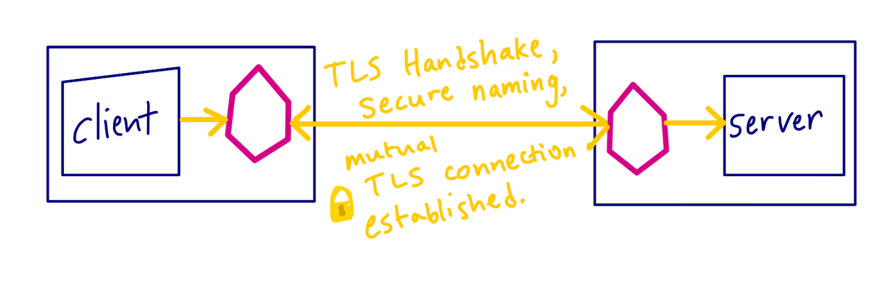
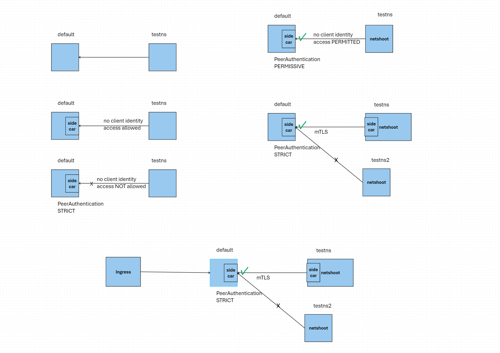
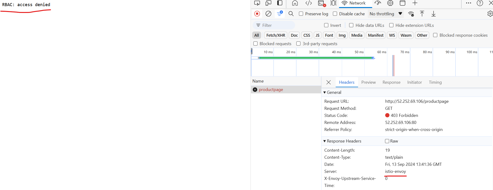

# Istio Security Lab

## Overview

This lab will guide you through implementing Istio's comprehensive security features to protect your microservices. Istio provides a complete security solution that includes:

- **Strong Identity**: X.509 certificates for every workload
- **Mutual TLS (mTLS)**: Automatic encryption of service-to-service communication
- **Authentication**: Both peer and request authentication
- **Authorization**: Fine-grained access control policies
- **Auditing**: Complete observability of security events

## Learning Objectives

By the end of this lab, you will understand:
1. How Istio provides security by default with automatic mTLS
2. How to configure PeerAuthentication policies for service-to-service authentication
3. How to implement AuthorizationPolicy for access control
4. How to use RequestAuthentication for end-user authentication with JWT
5. Best practices for securing microservices in production

## Security Architecture

Istio security involves multiple components working together:

- **Certificate Authority (CA)**: Manages keys and certificates automatically
- **Control Plane**: Distributes authentication and authorization policies
- **Sidecar Proxies**: Act as Policy Enforcement Points (PEPs)
- **Identity**: Based on service accounts with automatic certificate rotation



### High-Level Security Flow

```
┌─────────────────────────────────────────────────────────────────┐
│                     Istio Security Architecture                 │
├─────────────────────────────────────────────────────────────────┤
│                                                                 │
│  ┌─────────────┐    ┌──────────────┐    ┌─────────────┐        │
│  │   Client    │    │   Istiod     │    │   Server    │        │
│  │ (with proxy)│    │ (Control     │    │(with proxy) │        │
│  │             │    │  Plane)      │    │             │        │
│  └─────────────┘    └──────────────┘    └─────────────┘        │
│         │                   │                   │               │
│         │ 1. Request cert   │                   │               │
│         │ ────────────────► │                   │               │
│         │                   │                   │               │
│         │ 2. Issue cert     │                   │               │
│         │ ◄──────────────── │                   │               │
│         │                   │                   │               │
│         │                   │ 3. Distribute     │               │
│         │                   │    policies       │               │
│         │                   │ ────────────────► │               │
│         │                   │                   │               │
│         │ 4. mTLS handshake + Authorization     │               │
│         │ ──────────────────────────────────────►               │
│         │                                                       │
│  ┌─────────────────────────────────────────────────────────┐   │
│  │ Security Policies Applied:                              │   │
│  │ • PeerAuthentication (mTLS)                            │   │
│  │ • AuthorizationPolicy (Access Control)                 │   │
│  │ • RequestAuthentication (JWT Validation)               │   │
│  └─────────────────────────────────────────────────────────┘   │
└─────────────────────────────────────────────────────────────────┘
```

## Prerequisites

- AKS cluster with Istio service mesh installed
- kubectl configured to access your cluster
- Basic understanding of Kubernetes concepts

---

## Section 1: Understanding mTLS and PeerAuthentication

### What is Mutual TLS (mTLS)?

Mutual TLS provides:
- **Encryption**: All traffic between services is automatically encrypted
- **Authentication**: Both client and server verify each other's identity
- **Identity**: Each service has a strong cryptographic identity

### Key Concepts

- **PERMISSIVE mode**: Accepts both mTLS and plaintext traffic (useful for migration)
- **STRICT mode**: Only accepts mTLS traffic (recommended for production)
- **DISABLE mode**: Disables mTLS (not recommended)

### mTLS Traffic Flow Diagram

```
PERMISSIVE Mode:
┌─────────────┐    ┌─────────────┐    ┌─────────────┐
│   Client    │    │    Proxy    │    │   Server    │
│ (No Sidecar)│    │  (Sidecar)  │    │ (Sidecar)   │
└─────────────┘    └─────────────┘    └─────────────┘
       │                   │                   │
       │ Plaintext HTTP    │                   │
       │ ────────────────► │                   │
       │                   │ mTLS/HTTP         │
       │                   │ ────────────────► │
       │                   │                   │
       │ ◄──────────────── │ ◄──────────────── │

STRICT Mode:
┌─────────────┐    ┌─────────────┐    ┌─────────────┐
│   Client    │    │    Proxy    │    │   Server    │
│ (No Sidecar)│    │  (Sidecar)  │    │ (Sidecar)   │
└─────────────┘    └─────────────┘    └─────────────┘
       │                   │                   │
       │ Plaintext HTTP    │                   │
       │ ────────────────► │                   │
       │                   │                   │
       │ ✗ REJECTED        │                   │
       │ ◄──────────────── │                   │

┌─────────────┐    ┌─────────────┐    ┌─────────────┐
│   Client    │    │    Proxy    │    │   Server    │
│ (Sidecar)   │    │  (Sidecar)  │    │ (Sidecar)   │
└─────────────┘    └─────────────┘    └─────────────┘
       │                   │                   │
       │ mTLS              │                   │
       │ ────────────────► │                   │
       │                   │ mTLS              │
       │                   │ ────────────────► │
       │                   │                   │
       │ ◄──────────────── │ ◄──────────────── │
```

### Reference Documentation

- [Istio mTLS Migration Guide](https://istio.io/latest/docs/tasks/security/authentication/mtls-migration/#lock-down-to-mutual-tls-by-namespace)
- [Istio by Example - mTLS](https://istiobyexample.dev/mtls/)
- [Istio Security Concepts](https://istio.io/latest/docs/concepts/security/)

---

## Lab Exercise 1: Setting Up the Environment

### Step 1: Deploy the Sample Application

We'll use the Istio Bookinfo application to demonstrate security features.

**Lab Environment Architecture:**
```
┌─────────────────────────────────────────────────────────────────┐
│                        Lab Environment                         │
├─────────────────────────────────────────────────────────────────┤
│                                                                 │
│  ┌───────────────┐  ┌───────────────┐  ┌───────────────┐      │
│  │   testns      │  │   testns2     │  │   default     │      │
│  │ (no sidecar   │  │ (no sidecar   │  │ (with sidecar)│      │
│  │  initially)   │  │  initially)   │  │               │      │
│  │               │  │               │  │               │      │
│  │ ┌───────────┐ │  │ ┌───────────┐ │  │ ┌───────────┐ │      │
│  │ │ netshoot  │ │  │ │ netshoot  │ │  │ │productpage│ │      │
│  │ │    pod    │ │  │ │    pod    │ │  │ │   pod     │ │      │
│  │ └───────────┘ │  │ └───────────┘ │  │ └───────────┘ │      │
│  └───────────────┘  └───────────────┘  │ ┌───────────┐ │      │
│                                        │ │ reviews   │ │      │
│  ┌─────────────────────────────────────┤ │   pod     │ │      │
│  │     aks-istio-ingress               │ │ └───────────┘ │      │
│  │                                     │ └───────────────┘      │
│  │ ┌─────────────────────────────────┐ │                        │
│  │ │        Ingress Gateway          │ │                        │
│  │ │      (with sidecar)             │ │                        │
│  │ └─────────────────────────────────┘ │                        │
│  └─────────────────────────────────────┘                        │
│                                                                 │
│  External Traffic: Internet ──► Ingress Gateway ──► Services    │
└─────────────────────────────────────────────────────────────────┘
```

**Context Diagram:**


1. **Label the default namespace for sidecar injection:**
```bash
kubectl label namespace default istio.io/rev=asm-1-22
```

2. **Deploy the Bookinfo application:**
```bash
kubectl apply -f https://raw.githubusercontent.com/istio/istio/release-1.18/samples/bookinfo/platform/kube/bookinfo.yaml
```

3. **Verify the deployment:**
```bash
kubectl get pods -n default
kubectl get services -n default
```

### Step 2: Create Test Namespaces

We'll create test namespaces to demonstrate cross-namespace communication and security policies.

1. **Create test namespace without Istio injection:**
```bash
kubectl create ns testns
kubectl get ns --show-labels | grep testns
```

2. **Deploy a test pod for connectivity testing:**
```bash
kubectl -n testns run netshoot --image=nicolaka/netshoot -- sh -c 'sleep 2000'
kubectl -n testns get pod
```

### Step 3: Test Initial Connectivity

Before implementing security policies, let's verify that communication works:

```bash
# Test connectivity from testns (no sidecar) to default namespace (with sidecar)
kubectl -n testns exec netshoot -it -- curl productpage.default:9080/productpage
```

**Expected Result:** You should get a successful response. This shows that communication is working, but it's **not encrypted** because the testns namespace doesn't have Istio sidecars.

---

## Lab Exercise 2: Implementing mTLS with PeerAuthentication

### Understanding PeerAuthentication Modes

- **PERMISSIVE**: Default mode, accepts both mTLS and plaintext traffic
- **STRICT**: Only accepts mTLS traffic (recommended for production)
- **DISABLE**: Disables mTLS (not recommended)

### Lab 2 Architecture - mTLS Implementation

```
Phase 1: Initial State (PERMISSIVE mode)
┌─────────────────────────────────────────────────────────────────┐
│                                                                 │
│  testns (no sidecar)         default (with sidecars)           │
│  ┌─────────────────┐         ┌─────────────────────┐           │
│  │                 │         │                     │           │
│  │ ┌─────────────┐ │ HTTP    │ ┌─────────────────┐ │           │
│  │ │  netshoot   │ │────────►│ │   productpage   │ │           │
│  │ │    pod      │ │  ✓      │ │  (with proxy)   │ │           │
│  │ └─────────────┘ │         │ └─────────────────┘ │           │
│  └─────────────────┘         └─────────────────────┘           │
│                                                                 │
└─────────────────────────────────────────────────────────────────┘

Phase 2: STRICT Mode Applied
┌─────────────────────────────────────────────────────────────────┐
│                                                                 │
│  testns (no sidecar)         default (with sidecars)           │
│  ┌─────────────────┐         ┌─────────────────────┐           │
│  │                 │         │                     │           │
│  │ ┌─────────────┐ │ HTTP    │ ┌─────────────────┐ │           │
│  │ │  netshoot   │ │────────►│ │   productpage   │ │           │
│  │ │    pod      │ │  ✗      │ │  (with proxy)   │ │           │
│  │ └─────────────┘ │ REJECTED│ └─────────────────┘ │           │
│  └─────────────────┘         └─────────────────────┘           │
│                                                                 │
└─────────────────────────────────────────────────────────────────┘

Phase 3: testns Added to Mesh
┌─────────────────────────────────────────────────────────────────┐
│                                                                 │
│  testns (with sidecar)       default (with sidecars)           │
│  ┌─────────────────┐         ┌─────────────────────┐           │
│  │                 │         │                     │           │
│  │ ┌─────────────┐ │ mTLS    │ ┌─────────────────┐ │           │
│  │ │  netshoot   │ │────────►│ │   productpage   │ │           │
│  │ │ (w/ proxy)  │ │  ✓      │ │  (with proxy)   │ │           │
│  │ └─────────────┘ │         │ └─────────────────┘ │           │
│  └─────────────────┘         └─────────────────────┘           │
│                                                                 │
└─────────────────────────────────────────────────────────────────┘
```

### Step 1: Enable STRICT mTLS

1. **Apply STRICT mTLS policy to the default namespace:**
```bash
kubectl apply -f - <<EOF
apiVersion: security.istio.io/v1beta1
kind: PeerAuthentication
metadata:
  name: default
  namespace: default
spec:
  mtls:
    mode: STRICT
EOF
```

2. **Verify the policy is applied:**
```bash
kubectl get peerauthentication -A
```

### Step 2: Test Connectivity After STRICT mTLS

1. **Open K9S in another terminal to monitor the proxies:**
```bash
k9s
# Navigate to the default namespace and check the productpage pod
```

2. **Test connectivity from testns (should fail):**
```bash
kubectl -n testns exec netshoot -it -- curl productpage.default:9080/productpage
```

**Expected Result:** 
```
curl: (56) Recv failure: Connection reset by peer
```

**Why does this fail?** The testns namespace doesn't have Istio sidecars, so it can't establish mTLS connections. The STRICT policy rejects all non-mTLS traffic.

3. **Test browser access via ingress gateway:**
Access `http://YOUR_INGRESS_IP/productpage` - this should still work because the ingress gateway has Istio sidecars and can establish mTLS connections.

### Step 3: Understanding PERMISSIVE Mode

Let's temporarily switch to PERMISSIVE mode to understand the difference:

```bash
kubectl apply -f - <<EOF
apiVersion: security.istio.io/v1beta1
kind: PeerAuthentication
metadata:
  name: default
  namespace: default
spec:
  mtls:
    mode: PERMISSIVE
EOF
```

**Test connectivity again:**
```bash
kubectl -n testns exec netshoot -it -- curl productpage.default:9080/productpage
```

**Expected Result:** Connection should work now because PERMISSIVE mode accepts both mTLS and plaintext traffic.

### Step 4: Switch Back to STRICT Mode

For production security, we want STRICT mTLS:

```bash
kubectl apply -f - <<EOF
apiVersion: security.istio.io/v1beta1
kind: PeerAuthentication
metadata:
  name: default
  namespace: default
spec:
  mtls:
    mode: STRICT
EOF
```

### Step 5: Add testns to the Mesh

To enable secure communication from testns, we need to add it to the service mesh:

1. **Label testns for sidecar injection:**
```bash
kubectl label namespace testns istio.io/rev=asm-1-22 --overwrite
kubectl get ns --show-labels | grep testns
```

2. **Recreate the test pod with sidecar injection:**
```bash
kubectl delete pod netshoot -n testns --force
kubectl -n testns run netshoot --image=nicolaka/netshoot -- sh -c 'sleep 2000'
```

3. **Verify sidecar injection:**
```bash
kubectl get pod -n testns
# You should see 2/2 containers (application + sidecar)
```

4. **Test connectivity with mTLS:**
```bash
kubectl -n testns exec netshoot -it -- curl productpage.default:9080/productpage
```

**Expected Result:** Connection should work now because both sides have Istio sidecars and can establish mTLS.

---

## Lab Exercise 3: Advanced mTLS Testing

### Step 1: Create a Second Test Namespace

```bash
kubectl create ns testns2
kubectl -n testns2 run netshoot --image=nicolaka/netshoot -- sh -c 'sleep 2000'
kubectl get pod -A | grep netshoot
```

### Step 2: Test Cross-Namespace Communication

1. **Test from testns (with sidecar) - should work:**
```bash
kubectl -n testns exec netshoot -it -- curl productpage.default:9080/productpage
```

2. **Test from testns2 (without sidecar) - should fail:**
```bash
kubectl -n testns2 exec netshoot -it -- curl productpage.default:9080/productpage
```

### Step 3: Monitor with Envoy Logs

In K9S, navigate to the productpage pod and check the envoy container logs to see mTLS handshakes and connection attempts.

### Step 4: Add testns2 to the Mesh

```bash
kubectl label namespace testns2 istio.io/rev=asm-1-22 --overwrite
kubectl delete pod netshoot -n testns2 --force
kubectl -n testns2 run netshoot --image=nicolaka/netshoot -- sh -c 'sleep 2000'
```

Now both test namespaces should be able to communicate with the default namespace using mTLS.

---


## Lab Exercise 4: Authorization Policies

### Understanding Authorization in Istio

Authorization policies control **who** can access **what** resources. Key concepts:

- **Default Behavior**: Without policies, all traffic is allowed
- **Deny by Default**: When you apply any ALLOW policy, everything else is denied
- **Policy Precedence**: CUSTOM → DENY → ALLOW (in that order)
- **Service Identity**: Based on Kubernetes service accounts

### Lab 4 Architecture - Authorization Flow

```
Step 1: No Authorization Policies (Default Allow All)
┌─────────────────────────────────────────────────────────────────┐
│                                                                 │
│  testns              testns2              default              │
│  ┌─────────────┐     ┌─────────────┐     ┌─────────────┐       │
│  │ netshoot    │     │ netshoot    │     │ productpage │       │
│  │ (sidecar)   │────►│ (sidecar)   │────►│ (sidecar)   │       │
│  └─────────────┘  ✓  └─────────────┘  ✓  └─────────────┘       │
│                                                                 │
│  Browser ──────────────────────────────────────────► ✓         │
│  (via Ingress Gateway)                                          │
└─────────────────────────────────────────────────────────────────┘

Step 2: Restrictive Policy Applied (testns only)
┌─────────────────────────────────────────────────────────────────┐
│                                                                 │
│  testns              testns2              default              │
│  ┌─────────────┐     ┌─────────────┐     ┌─────────────┐       │
│  │ netshoot    │     │ netshoot    │     │ productpage │       │
│  │ (sidecar)   │────►│ (sidecar)   │──X──│ (sidecar)   │       │
│  └─────────────┘  ✓  └─────────────┘ DENY└─────────────┘       │
│                                           ▲                     │
│                    AuthorizationPolicy    │                     │
│                    allows only testns ────┘                     │
│                                                                 │
│  Browser ──X──────────────────────────────────────► DENY       │
│  (via Ingress Gateway)                                          │
└─────────────────────────────────────────────────────────────────┘

Step 3: Ingress Gateway Added to Policy
┌─────────────────────────────────────────────────────────────────┐
│                                                                 │
│  testns              testns2              default              │
│  ┌─────────────┐     ┌─────────────┐     ┌─────────────┐       │
│  │ netshoot    │     │ netshoot    │     │ productpage │       │
│  │ (sidecar)   │────►│ (sidecar)   │──X──│ (sidecar)   │       │
│  └─────────────┘  ✓  └─────────────┘ DENY└─────────────┘       │
│                                           ▲                     │
│                    AuthorizationPolicy    │                     │
│                    allows testns +        │                     │
│                    ingress gateway ───────┘                     │
│                                                                 │
│  Browser ──────────────────────────────────────────► ✓         │
│  (via Ingress Gateway)                                          │
└─────────────────────────────────────────────────────────────────┘
```

### Step 1: Current State Check

Before applying authorization policies, verify current access:

```bash
# Check existing authorization policies
kubectl get authorizationpolicy -A

# Test access from both namespaces
kubectl -n testns exec netshoot -it -- curl productpage.default:9080/productpage
kubectl -n testns2 exec netshoot -it -- curl productpage.default:9080/productpage

# Test browser access
# http://YOUR_INGRESS_IP/productpage
```

**Expected Result:** All should work since no authorization policies are applied yet.

### Step 2: Apply Restrictive Authorization Policy

Let's create a policy that only allows access from the testns namespace:

```bash
kubectl apply -f - <<EOF
apiVersion: security.istio.io/v1beta1
kind: AuthorizationPolicy
metadata:
  name: productpage-access
  namespace: default
spec:
  selector:
    matchLabels:
      app: productpage
  action: ALLOW
  rules:
    - from:
        - source:
            principals: ["cluster.local/ns/testns/sa/default"]
EOF
```

**What this policy does:**
- **Selector**: Targets workloads with label `app: productpage`
- **Action**: ALLOW (but remember, this creates "deny by default" for everything else)
- **Rules**: Only allows traffic from the service account `default` in namespace `testns`

### Step 3: Test Authorization Policy

1. **Test from testns (should work):**
```bash
kubectl -n testns exec netshoot -it -- curl productpage.default:9080/productpage
```

2. **Test from testns2 (should fail):**
```bash
kubectl -n testns2 exec netshoot -it -- curl productpage.default:9080/productpage
```

**Expected Result:** 
```
RBAC: access denied
```

3. **Test browser access (should fail):**
Access `http://YOUR_INGRESS_IP/productpage`



**Why does browser access fail?** The ingress gateway uses a different service account than what's allowed in our policy.

### Step 4: Fix Ingress Gateway Access

To allow browser access, we need to include the ingress gateway's service account:

```bash
kubectl apply -f - <<EOF
apiVersion: security.istio.io/v1beta1
kind: AuthorizationPolicy
metadata:
  name: productpage-access
  namespace: default
spec:
  selector:
    matchLabels:
      app: productpage
  action: ALLOW
  rules:
    - from:
        - source:
            principals: ["cluster.local/ns/aks-istio-ingress/sa/aks-istio-ingressgateway-external",
                         "cluster.local/ns/testns/sa/default"]
EOF
```

**Test again:**
- testns: Should work ✓
- testns2: Should fail ✗
- Browser: Should work ✓

### Step 5: Add testns2 to Allowed Principals

```bash
kubectl apply -f - <<EOF
apiVersion: security.istio.io/v1beta1
kind: AuthorizationPolicy
metadata:
  name: productpage-access
  namespace: default
spec:
  selector:
    matchLabels:
      app: productpage
  action: ALLOW
  rules:
    - from:
        - source:
            principals: ["cluster.local/ns/aks-istio-ingress/sa/aks-istio-ingressgateway-external",
                         "cluster.local/ns/testns/sa/default",
                         "cluster.local/ns/testns2/sa/default"]
EOF
```

**Test from testns2:**
```bash
kubectl -n testns2 exec netshoot -it -- curl productpage.default:9080/productpage
```

**Expected Result:** Should work now ✓

---

## Understanding Security Policy Types

### PeerAuthentication vs AuthorizationPolicy

| Aspect | PeerAuthentication | AuthorizationPolicy |
|--------|-------------------|---------------------|
| **Purpose** | How traffic is authenticated | Who can access what |
| **Focus** | mTLS settings and encryption | Access control and permissions |
| **Example** | "All traffic must use mTLS" | "Only testns can access productpage" |
| **When to use** | Service-to-service encryption | Fine-grained access control |

### Key Differences

- **PeerAuthentication**: Ensures secure communication channels (the "how")
- **AuthorizationPolicy**: Controls access permissions (the "who" and "what")
- **Both work together**: PeerAuthentication establishes trust, AuthorizationPolicy enforces access rules

---


## Lab Exercise 5: Request Authentication with JWT

### Understanding Request Authentication

**RequestAuthentication** validates end-user credentials attached to requests, typically JWT tokens. Key concepts:

- **Purpose**: Verify the identity of the end user making the request
- **JWT Validation**: Validates tokens against specified issuers and public keys
- **Behavior**: Invalid tokens are rejected; requests without tokens are accepted by default
- **Integration**: Works with OAuth2/OIDC providers like Azure AD, Auth0, Google, etc.

### Lab 5 Architecture - JWT Authentication Flow

```
Request Authentication + Authorization Flow
┌─────────────────────────────────────────────────────────────────┐
│                                                                 │
│  External User          Ingress Gateway         Application     │
│  ┌─────────────┐       ┌─────────────────┐     ┌─────────────┐ │
│  │             │       │                 │     │             │ │
│  │   Browser   │       │   Gateway       │     │ productpage │ │
│  │             │       │  (with proxy)   │     │ (sidecar)   │ │
│  └─────────────┘       └─────────────────┘     └─────────────┘ │
│         │                       │                       │       │
│         │1. Request w/o token   │                       │       │
│         │──────────────────────►│                       │       │
│         │                       │ RequestAuthentication │       │
│         │                       │ validates token       │       │
│         │                       │ (no token = accept)   │       │
│         │                       │                       │       │
│         │                       │2. Forward request     │       │
│         │                       │──────────────────────►│       │
│         │                       │                       │       │
│         │3. Response            │                       │       │
│         │◄──────────────────────│◄──────────────────────│       │
│                                                                 │
│  With Authorization Policy Requiring Authentication:            │
│         │                       │                       │       │
│         │4. Request w/o token   │                       │       │
│         │──────────────────────►│                       │       │
│         │                       │ AuthorizationPolicy   │       │
│         │                       │ requires auth         │       │
│         │                       │ (no token = deny)     │       │
│         │                       │                       │       │
│         │5. 403 Forbidden       │                       │       │
│         │◄──────────────────────│                       │       │
│                                                                 │
│  With Valid JWT Token:                                         │
│         │                       │                       │       │
│         │6. Request with JWT    │                       │       │
│         │──────────────────────►│                       │       │
│         │                       │ JWT validated         │       │
│         │                       │ + authorized          │       │
│         │                       │                       │       │
│         │                       │7. Forward request     │       │
│         │                       │──────────────────────►│       │
│         │                       │                       │       │
│         │8. Response            │                       │       │
│         │◄──────────────────────│◄──────────────────────│       │
└─────────────────────────────────────────────────────────────────┘
```

### Official Definition
> "RequestAuthentication defines what request authentication methods are supported by a workload. It will reject a request if the request contains invalid authentication information, based on the configured authentication rules. A request that does not contain any authentication credentials will be accepted but will not have any authenticated identity."

### Step 1: Configure RequestAuthentication with Azure AD

**Note:** Replace the placeholder tenant IDs with your actual Azure AD tenant ID.

```bash
kubectl apply -f - <<EOF
apiVersion: security.istio.io/v1beta1
kind: RequestAuthentication
metadata:
  name: reqauth-product-jwt
  namespace: aks-istio-ingress
spec:
  jwtRules:
    - issuer: "https://sts.windows.net/xxxxxxxx-xxxx-xxxx-xxxx-xxxxxxxxxxxx/"
      jwksUri: "https://login.microsoftonline.com/xxxxxxxx-xxxx-xxxx-xxxx-xxxxxxxxxxxx/discovery/v2.0/keys"
EOF
```

**What this does:**
- Configures JWT validation for the ingress gateway
- Specifies Azure AD as the trusted issuer
- Defines where to fetch public keys for token verification

### Step 2: Test Without Authorization Policy

At this point, RequestAuthentication only validates tokens but doesn't enforce authentication:

```bash
# Test without token (should work)
curl http://YOUR_INGRESS_IP/productpage

# Test with invalid token (should fail)
curl http://YOUR_INGRESS_IP/productpage -H "Authorization: Bearer invalid_token"
```

### Step 3: Enforce Authentication with Authorization Policy

To require authentication, combine RequestAuthentication with AuthorizationPolicy:

```bash
kubectl apply -f - <<EOF
apiVersion: security.istio.io/v1beta1
kind: AuthorizationPolicy
metadata:
  name: authz-product-require-auth
  namespace: aks-istio-ingress
spec:
  action: ALLOW
  rules:
    - from:
        - source:
            requestPrincipals: ["*"]
EOF
```

**What this does:**
- Requires any authenticated user (requestPrincipals: ["*"])
- Rejects requests without valid JWT tokens

### Step 4: Test Authentication Enforcement

```bash
# Test without token (should fail with 403)
curl http://YOUR_INGRESS_IP/productpage

# Test with valid token (should work - see next steps for token acquisition)
curl http://YOUR_INGRESS_IP/productpage -H "Authorization: Bearer $VALID_TOKEN"
```

---

## Lab Exercise 6: Azure Managed Identity Integration

### Step 1: Create Azure Managed Identity

```bash
# Create a user-assigned managed identity
az identity create --name app1uami --resource-group YOUR_RESOURCE_GROUP

# Get the identity details
az ad sp list --all --display-name "app1uami"
# Note down the Object ID (Principal ID) for later use
```

### Azure Managed Identity Architecture

```
Azure Managed Identity Integration Flow
┌─────────────────────────────────────────────────────────────────┐
│                                                                 │
│  Azure VM               Azure AD              AKS + Istio       │
│  ┌─────────────┐       ┌─────────────┐       ┌─────────────┐   │
│  │             │       │             │       │             │   │
│  │    VM       │       │  Azure AD   │       │ Ingress     │   │
│  │ (with UAM   │       │  (Issuer)   │       │ Gateway     │   │
│  │ Identity)   │       │             │       │             │   │
│  └─────────────┘       └─────────────┘       └─────────────┘   │
│         │                       │                       │       │
│         │1. Request token       │                       │       │
│         │ using managed identity│                       │       │
│         │──────────────────────►│                       │       │
│         │                       │                       │       │
│         │2. Return JWT token    │                       │       │
│         │◄──────────────────────│                       │       │
│         │                       │                       │       │
│         │3. API call with JWT   │                       │       │
│         │──────────────────────────────────────────────►│       │
│         │                       │                       │       │
│         │                       │ 4. Validate token     │       │
│         │                       │    against Azure AD   │       │
│         │                       │◄──────────────────────│       │
│         │                       │                       │       │
│         │                       │ 5. Token valid        │       │
│         │                       │──────────────────────►│       │
│         │                       │                       │       │
│         │                       │                       │       │
│         │6. Access granted                              │       │
│         │◄──────────────────────────────────────────────│       │
│                                                                 │
│  Components:                                                    │
│  • Azure VM with User-Assigned Managed Identity                │
│  • Azure AD as JWT issuer                                      │
│  • Istio RequestAuthentication for JWT validation              │
│  • Istio AuthorizationPolicy for access control               │
└─────────────────────────────────────────────────────────────────┘
```

### Step 2: Configure Authorization with Specific Identity

```bash
kubectl apply -f - <<EOF
apiVersion: security.istio.io/v1beta1
kind: AuthorizationPolicy
metadata:
  name: authz-product-managed-identity
  namespace: aks-istio-ingress
spec:
  action: ALLOW
  rules:
    - from:
        - source:
            requestPrincipals: ["*"]
      when:
        - key: request.auth.claims[sub]
          values: ["MANAGED_IDENTITY_OBJECT_ID"]
EOF
```

### Step 3: Test from Azure VM

1. **Create an Azure VM in the same resource group**
2. **Assign the user-assigned managed identity to the VM**
3. **SSH to the VM and install Azure CLI**

```bash
# Login with managed identity
az login --identity --username "MANAGED_IDENTITY_CLIENT_ID" --allow-no-subscriptions

# Get access token
export ACCESSTOKEN=$(az account get-access-token --query accessToken --output tsv)

# Decode and inspect token
echo $ACCESSTOKEN | cut -d '.' -f2 | base64 --decode | jq .

# Test access
curl http://YOUR_INGRESS_IP/productpage -H "Authorization: Bearer $ACCESSTOKEN"
```

### Step 4: Test from Local Machine

You can also test with your personal Azure AD account:

```bash
# Get token with your identity
export ACCESSTOKEN=$(az account get-access-token --query accessToken --output tsv)

# Inspect token claims
echo $ACCESSTOKEN | cut -d '.' -f2 | base64 --decode | jq .
```

**Configure authorization for your user:**
```bash
kubectl apply -f - <<EOF
apiVersion: security.istio.io/v1beta1
kind: AuthorizationPolicy
metadata:
  name: authz-product-user
  namespace: aks-istio-ingress
spec:
  action: ALLOW
  rules:
    - from:
        - source:
            requestPrincipals: ["*"]
      when:
        - key: request.auth.claims[upn]
          values: ["admin@mytenant.onmicrosoft.com"]
EOF
```

**Test access:**
```bash
curl http://YOUR_INGRESS_IP/productpage -H "Authorization: Bearer $ACCESSTOKEN"
```

---

## Advanced Authorization Patterns

### 1. Path-Based Authorization

```bash
kubectl apply -f - <<EOF
apiVersion: security.istio.io/v1beta1
kind: AuthorizationPolicy
metadata:
  name: path-based-authz
  namespace: default
spec:
  selector:
    matchLabels:
      app: productpage
  action: ALLOW
  rules:
    # Allow public access to health checks
    - to:
        - operation:
            paths: ["/health", "/ready"]
    # Require authentication for all other paths
    - to:
        - operation:
            notPaths: ["/health", "/ready"]
      from:
        - source:
            requestPrincipals: ["*"]
EOF
```

### Authorization Pattern Architectures

```
1. Path-Based Authorization
┌─────────────────────────────────────────────────────────────────┐
│                                                                 │
│  External Requests              Application                     │
│  ┌─────────────────┐           ┌─────────────────────┐         │
│  │                 │           │                     │         │
│  │ /health         │ ────────► │ productpage         │         │
│  │ /ready          │    ✓      │                     │         │
│  │ (no auth reqd)  │           │ Path-based          │         │
│  └─────────────────┘           │ AuthorizationPolicy │         │
│                                │                     │         │
│  ┌─────────────────┐           │                     │         │
│  │                 │ ────────► │                     │         │
│  │ /productpage    │    ✓      │                     │         │
│  │ (auth required) │ w/ JWT    │                     │         │
│  └─────────────────┘           └─────────────────────┘         │
│                                                                 │
│  ┌─────────────────┐                                           │
│  │                 │ ──────X── Policy denies access            │
│  │ /productpage    │   DENY   without authentication          │
│  │ (no JWT)        │                                           │
│  └─────────────────┘                                           │
└─────────────────────────────────────────────────────────────────┘

2. Method-Based Authorization
┌─────────────────────────────────────────────────────────────────┐
│                                                                 │
│  HTTP Methods                   Application                     │
│  ┌─────────────────┐           ┌─────────────────────┐         │
│  │                 │           │                     │         │
│  │ GET requests    │ ────────► │ productpage         │         │
│  │ (all users)     │    ✓      │                     │         │
│  └─────────────────┘           │ Method-based        │         │
│                                │ AuthorizationPolicy │         │
│  ┌─────────────────┐           │                     │         │
│  │                 │ ────────► │                     │         │
│  │ POST/PUT/DELETE │    ✓      │                     │         │
│  │ (admin role)    │ w/ admin  │                     │         │
│  └─────────────────┘    role   └─────────────────────┘         │
│                                                                 │
│  ┌─────────────────┐                                           │
│  │                 │ ──────X── Policy denies POST              │
│  │ POST request    │   DENY   without admin role               │
│  │ (no admin role) │                                           │
│  └─────────────────┘                                           │
└─────────────────────────────────────────────────────────────────┘

3. Time-Based Access Control
┌─────────────────────────────────────────────────────────────────┐
│                                                                 │
│  Time Windows                   Application                     │
│  ┌─────────────────┐           ┌─────────────────────┐         │
│  │                 │           │                     │         │
│  │ Normal Hours    │ ────────► │ productpage         │         │
│  │ (0-1, 4-23 UTC) │    ✓      │                     │         │
│  └─────────────────┘           │ Time-based          │         │
│                                │ AuthorizationPolicy │         │
│  ┌─────────────────┐           │                     │         │
│  │                 │ ──────X── │                     │         │
│  │ Maintenance     │   DENY    │                     │         │
│  │ (2-3 AM UTC)    │           │                     │         │
│  └─────────────────┘           └─────────────────────┘         │
│                                                                 │
│  Policy: DENY access during maintenance window                 │
└─────────────────────────────────────────────────────────────────┘
```

### 2. Method-Based Authorization

```bash
kubectl apply -f - <<EOF
apiVersion: security.istio.io/v1beta1
kind: AuthorizationPolicy
metadata:
  name: method-based-authz
  namespace: default
spec:
  selector:
    matchLabels:
      app: productpage
  action: ALLOW
  rules:
    # Allow GET requests for all users
    - to:
        - operation:
            methods: ["GET"]
    # Require admin role for POST/PUT/DELETE
    - to:
        - operation:
            methods: ["POST", "PUT", "DELETE"]
      when:
        - key: request.auth.claims[roles]
          values: ["admin"]
EOF
```

### 3. Time-Based Access Control

```bash
kubectl apply -f - <<EOF
apiVersion: security.istio.io/v1beta1
kind: AuthorizationPolicy
metadata:
  name: time-based-authz
  namespace: default
spec:
  selector:
    matchLabels:
      app: productpage
  action: DENY
  rules:
    # Deny access during maintenance window (2-4 AM UTC)
    - when:
        - key: request.time.hour
          values: ["2", "3"]
EOF
```

---

## Monitoring and Troubleshooting

### View Ingress Gateway Logs

```bash
kubectl -n aks-istio-ingress logs -l app=aks-istio-ingressgateway-external
```

### Check Policy Status

```bash
# List all security policies
kubectl get peerauthentication,requestauthentication,authorizationpolicy -A

# Describe specific policies
kubectl describe authorizationpolicy productpage-access -n default
```

### Debug Authorization Failures

1. **Check Envoy access logs** in the sidecar containers
2. **Verify service account identities** using:
```bash
kubectl get serviceaccounts -A
```
3. **Validate JWT tokens** by decoding them:
```bash
echo $TOKEN | cut -d '.' -f2 | base64 --decode | jq .
```

---

## Best Practices and Production Considerations

### 1. Security Policy Best Practices

#### Start with Restrictive Policies
```bash
# Start with deny-all and gradually add permissions
kubectl apply -f - <<EOF
apiVersion: security.istio.io/v1beta1
kind: AuthorizationPolicy
metadata:
  name: deny-all-default
  namespace: default
spec:
  action: DENY
  rules:
  - {}
EOF
```

#### Use Principle of Least Privilege
- Grant only the minimum permissions required
- Use specific service accounts, not wildcards
- Implement path and method-based restrictions

#### Layer Your Security
1. **Network policies** at the Kubernetes level
2. **PeerAuthentication** for service-to-service encryption
3. **AuthorizationPolicy** for access control
4. **RequestAuthentication** for end-user verification

### 2. mTLS Migration Strategy

#### Phase 1: Enable PERMISSIVE Mode
```bash
kubectl apply -f - <<EOF
apiVersion: security.istio.io/v1beta1
kind: PeerAuthentication
metadata:
  name: default
  namespace: istio-system
spec:
  mtls:
    mode: PERMISSIVE
EOF
```

#### Phase 2: Monitor and Validate
- Use Istio telemetry to monitor mTLS adoption
- Check that all services have sidecars injected
- Verify certificate rotation is working

#### Phase 3: Enforce STRICT Mode
```bash
kubectl apply -f - <<EOF
apiVersion: security.istio.io/v1beta1
kind: PeerAuthentication
metadata:
  name: default
  namespace: istio-system
spec:
  mtls:
    mode: STRICT
EOF
```

### 3. Identity and Certificate Management

#### Automatic Certificate Rotation
- Certificates are automatically rotated every 24 hours by default
- Monitor certificate expiration in production
- Ensure istiod has proper RBAC permissions

#### Service Account Security
```bash
# Create dedicated service accounts for different services
kubectl create serviceaccount productpage-sa -n default
kubectl create serviceaccount ratings-sa -n default

# Use specific service accounts in deployments
# spec:
#   serviceAccountName: productpage-sa
```

### 4. Monitoring and Observability

#### Security Metrics to Monitor
- mTLS connection success/failure rates
- Authorization policy violations
- JWT validation failures
- Certificate rotation events

#### Alerting on Security Events
```bash
# Example: Alert on authorization failures
sum(rate(envoy_http_rbac_denied[5m])) > 0.1
```

### 5. Compliance and Auditing

#### Audit Log Configuration
- Enable Kubernetes audit logging
- Configure Istio access logs with security information
- Set up centralized log collection

#### Compliance Requirements
- Regularly review and update security policies
- Document authorization policies and their purposes
- Implement automated policy validation

---

## Lab Cleanup

### Remove Authorization Policies
```bash
kubectl delete authorizationpolicy --all -n default
kubectl delete authorizationpolicy --all -n aks-istio-ingress
```

### Remove Authentication Policies
```bash
kubectl delete peerauthentication --all -n default
kubectl delete requestauthentication --all -n aks-istio-ingress
```

### Clean Up Test Resources
```bash
kubectl delete namespace testns testns2
kubectl delete -f https://raw.githubusercontent.com/istio/istio/release-1.18/samples/bookinfo/platform/kube/bookinfo.yaml
```

---

## Summary and Key Takeaways

### What We Learned

1. **mTLS Fundamentals**:
   - Automatic encryption between services
   - PERMISSIVE vs STRICT modes
   - Certificate management and rotation

2. **Authentication Types**:
   - **Peer Authentication**: Service-to-service (mTLS)
   - **Request Authentication**: End-user JWT validation

3. **Authorization Policies**:
   - Principle of least privilege
   - Service account-based access control
   - Path, method, and condition-based rules

4. **Integration Patterns**:
   - Azure AD/Entra ID integration
   - Managed identity authentication
   - Multi-layer security approach

### Security Model Summary

```
┌─────────────────────────────────────────────────────────────┐
│                    Istio Security Layers                   │
├─────────────────────────────────────────────────────────────┤
│ RequestAuthentication │ End-user JWT validation            │
├─────────────────────────────────────────────────────────────┤
│ AuthorizationPolicy   │ Who can access what resources      │
├─────────────────────────────────────────────────────────────┤
│ PeerAuthentication    │ Service-to-service mTLS            │
├─────────────────────────────────────────────────────────────┤
│ Network Policies      │ Kubernetes network-level control   │
└─────────────────────────────────────────────────────────────┘
```

### Complete Security Implementation Flow

```
End-to-End Security Architecture
┌─────────────────────────────────────────────────────────────────┐
│                                                                 │
│  External User          Ingress             Service Mesh       │
│  ┌─────────────┐       ┌─────────────┐      ┌─────────────┐    │
│  │             │       │             │      │             │    │
│  │   Client    │       │  Gateway    │      │ Application │    │
│  │             │       │ (+ proxy)   │      │ (+ proxy)   │    │
│  └─────────────┘       └─────────────┘      └─────────────┘    │
│         │                       │                      │        │
│         │ 1. HTTPS + JWT        │                      │        │
│         │──────────────────────►│                      │        │
│         │                       │                      │        │
│         │    RequestAuthentication (JWT validation)    │        │
│         │                       │                      │        │
│         │    AuthorizationPolicy (Access control)      │        │
│         │                       │                      │        │
│         │                       │ 2. mTLS              │        │
│         │                       │─────────────────────►│        │
│         │                       │                      │        │
│         │            PeerAuthentication (mTLS)         │        │
│         │                       │                      │        │
│         │                       │ 3. Authorized        │        │
│         │                       │    Request           │        │
│         │                       │─────────────────────►│        │
│         │                       │                      │        │
│         │ 4. Response           │◄─────────────────────│        │
│         │◄──────────────────────│                      │        │
│                                                                 │
│  Security Layers Applied:                                       │
│  ┌─────────────────────────────────────────────────────────┐   │
│  │ 1. TLS termination at ingress                          │   │
│  │ 2. JWT validation (RequestAuthentication)              │   │
│  │ 3. Access control (AuthorizationPolicy)                │   │
│  │ 4. Service-to-service mTLS (PeerAuthentication)        │   │
│  │ 5. Network policies (if configured)                    │   │
│  └─────────────────────────────────────────────────────────┘   │
└─────────────────────────────────────────────────────────────────┘
```

### Production Readiness Checklist

- [ ] All namespaces have sidecar injection enabled
- [ ] mTLS is in STRICT mode for production workloads
- [ ] Authorization policies follow least privilege principle
- [ ] JWT validation is configured for user-facing services
- [ ] Security policies are version controlled
- [ ] Monitoring and alerting are configured
- [ ] Regular security policy reviews are scheduled
- [ ] Certificate rotation is monitored
- [ ] Backup and disaster recovery plans include security policies

---

## Additional Resources

### Official Documentation
- [Istio Security Concepts](https://istio.io/latest/docs/concepts/security/)
- [Authentication Tasks](https://istio.io/latest/docs/tasks/security/authentication/)
- [Authorization Tasks](https://istio.io/latest/docs/tasks/security/authorization/)
- [Security Policy Examples](https://istio.io/latest/docs/ops/configuration/security/security-policy-examples/)

### Reference Links
- [Istio mTLS Migration Guide](https://istio.io/latest/docs/tasks/security/authentication/mtls-migration/)
- [Authorization Policy Reference](https://istio.io/latest/docs/reference/config/security/authorization-policy/)
- [Security Troubleshooting](https://istio.io/latest/docs/ops/common-problems/security-issues/)

### Community Resources
- [Istio by Example - Security](https://istiobyexample.dev/mtls/)
- [Security Best Practices](https://istio.io/latest/docs/ops/best-practices/security/)

---

**Congratulations!** You have successfully completed the Istio Security lab. You now understand how to implement defense-in-depth security for microservices using Istio's comprehensive security features.