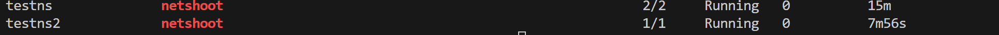

## Istio Security

PeerAuthentication, AuthorizationPolicy, RequestAuthentication, and DestinationRule are the main Istio security resources.   


### mTLS, PeerAuthentication


#### Reference

https://istio.io/latest/docs/tasks/security/authentication/mtls-migration/#lock-down-to-mutual-tls-by-namespace  

https://istiobyexample.dev/mtls/  


#### Steps  


Picture for context: 


Deploy the bookinfo application.  

kubectl label namespace default istio.io/rev=asm-1-22

```bash
kubectl apply -f https://raw.githubusercontent.com/istio/istio/release-1.18/samples/bookinfo/platform/kube/bookinfo.yaml
```


Let's test connectivity from a test namespace to our application running in the default namespace.  


let's create a test namespace and deploy a test application. 

```
k create ns testns

k get ns --show-labels | grep testns  

k -n testns run netshoot --image=nicolaka/netshoot -- sh -c 'sleep 2000'

k -n testns get pod

k get peerauthentication  -A

Run curl from netshoot pod in the test namespace. 

k -n testns exec netshoot -it -- curl productpage.default:9080/productpage

Alternatively,  
k -n testns exec netshoot -it -- bash
curl productpage.default:9080/productpage
```

You should get a response. This also means that the application traffic from test namespace to default namespace is not encrypted. There is no sidecar proxy in the test namespace. You are making a direct curl call to the application in the default namespace.


```bash
kubectl apply -f - <<EOF
apiVersion: security.istio.io/v1beta1
kind: PeerAuthentication
metadata:
  name: default
  namespace: default
spec:
  mtls:
    mode: STRICT
EOF
```

Open K9S  -  check envoy sidecar proxy in the default namespace for productpage.  

Issue curl command again from the test namespace. 

k -n testns exec netshoot -it -- curl productpage.default:9080/productpage

You should get a response like this.  
curl: (56) Recv failure: Connection reset by peer

Now, go to your browser and access with ingress gateway IP:port/productpage. You should see the application.   At this time, we are enforcing mTLS for default namespace. Traffic is encrypted from ingress to the application in the default namespace.  However, with mode: STRICT, the traffic from the test namespace is not encrypted and hence the connection is reset / denied.

Let's change it back to PERMISSIVE mode.   
```bash
kubectl apply -f - <<EOF
apiVersion: security.istio.io/v1beta1
kind: PeerAuthentication
metadata:
  name: default
  namespace: default
spec:
  mtls:
    mode: PERMISSIVE
EOF
```

k -n testns exec netshoot -it -- curl productpage.default:9080/productpage

We should be able to access the application from the test namespace.  Once this is verified, change it back to STRICT mode.   
```bash
kubectl apply -f - <<EOF
apiVersion: security.istio.io/v1beta1
kind: PeerAuthentication
metadata:
  name: default
  namespace: default
spec:
  mtls:
    mode: STRICT
EOF
```


If we add test namespace to the policy, we should be able to access the application. 

Let's add test namespace to the mesh.  Keep K9S open in another terminal and switch to testns namespace.  

```bash
kubectl label namespace testns istio.io/rev=asm-1-22 --overwrite
k get ns --show-labels | grep testns  
k delete pod netshoot -n testns --force
k -n testns run netshoot --image=nicolaka/netshoot -- sh -c 'sleep 2000'
```


```bash
kubectl apply -f - <<EOF
apiVersion: security.istio.io/v1beta1
kind: PeerAuthentication
metadata:
  name: default
  namespace: default
spec:
  mtls:
    mode: STRICT
EOF
```

Let's create another namespace testns2 and deploy a test application. 
```bash
k create ns testns2
k -n testns2 run netshoot --image=nicolaka/netshoot -- sh -c 'sleep 2000'
k get pod -A | grep netshoot
```


Ensure that pod has been created in the testns namespace with sidecar injected.

```bash
k get pod -A | grep netshoot
k get ns --show-labels | grep testns  
k get peerauthentication  -A
```




ssh to the netshoot pod in testns and testns2 namespaces (use two terminals). 

```bash
k -n testns exec netshoot -it -- bash
k -n testns2 exec netshoot -it -- bash
```


alternatively, you can use the following command to run curl command from the netshoot pod.  Open k9s and get into the productpage pod and envoy container.  You can see the logs.  
```bash
k -n testns exec netshoot -it -- curl productpage.default:9080/productpage
k -n testns2 exec netshoot -it -- curl productpage.default:9080/productpage
```


curl productpage.default:9080/productpage
it should work for testns namespace but not for testns2 namespace.  Reason is that we have not added testns2 namespace to the mesh. When it is not part of the mesh, it does not have the envoy sidecar proxy and the certificate to communicate with the application in the default namespace. 

```bash
k get PeerAuthentication -A
```


### AuthorizationPolicy  


Let's create an authorization policy to allow access from test namespace to default namespace.  Access is allowed only for the service account default in the test namespace. Access is allowed to the productpage service (don't confuse with the kubernetes service) in the default namespace. Product service is matched with the label app: productpage.   

```bash
k get authorizationpolicy -A  
```

Lets bring testns2 namespace into the mesh.  
```bash
kubectl label namespace testns2 istio.io/rev=asm-1-22 --overwrite
k get ns --show-labels | grep testns  
k delete pod netshoot -n testns2 --force
k -n testns2 run netshoot --image=nicolaka/netshoot -- sh -c 'sleep 2000'
```

Nothing defined yet. Open k9s and check the logs for productpage envoy proxy.  

```bash
k -n testns exec netshoot -it -- curl productpage.default:9080/productpage
k -n testns2 exec netshoot -it -- curl productpage.default:9080/productpage 
```
expect success for the first one. 
expect success for the second one. 
http://135.232.45.103/productpage from browser should work. 

```bash
kubectl apply -f - <<EOF
apiVersion: security.istio.io/v1beta1
kind: AuthorizationPolicy
metadata:
  name: default
  namespace: default
spec:
  selector:
    matchLabels:
      app: productpage
  action: ALLOW
  rules:
    - from:
        - source:
            principals: ["cluster.local/ns/testns/sa/default"]
EOF
```

Test again

```bash
k -n testns exec netshoot -it -- curl productpage.default:9080/productpage
k -n testns2 exec netshoot -it -- curl productpage.default:9080/productpage 
```

expect success for the first one. 
expect failure for the second one. 
http://135.232.45.103/productpage from browser should work. 
try accessing the application from the browser.  It shouldn't work. You should be gettig RBAC: access denied.

same for the testns2 namespace. You have secured the application with the authorization policy.


When AuthorizationPolicy is applied, it automatically denies all traffic that is not explicitly allowed.  In this case, we have allowed traffic only from the testns namespace.  Hence, the browser access is denied which is routed through the ingress gateway.  

Let's add ingress gateway service account to the policy. 

```bash
kubectl apply -f - <<EOF
apiVersion: security.istio.io/v1beta1
kind: AuthorizationPolicy
metadata:
  name: default
  namespace: default
spec:
  selector:
    matchLabels:
      app: productpage
  action: ALLOW
  rules:
    - from:
        - source:
            principals: ["cluster.local/ns/aks-istio-ingress/sa/aks-istio-ingressgateway-external",
                         "cluster.local/ns/testns/sa/default"]
EOF
```

test again. 

```bash
k -n testns exec netshoot -it -- curl productpage.default:9080/productpage
k -n testns2 exec netshoot -it -- curl productpage.default:9080/productpage 
```

expect success for the first one. 
expect failure for the second one. 
http://135.232.45.103/productpage from browser should work. 
Check the browser access. It should work.

Refer to the Istio documentation for more details on the security policies.  
https://istio.io/latest/docs/reference/config/security/authorization-policy/  


```bash
kubectl apply -f - <<EOF
apiVersion: security.istio.io/v1beta1
kind: AuthorizationPolicy
metadata:
  name: default
  namespace: default
spec:
  selector:
    matchLabels:
      app: productpage
  action: ALLOW
  rules:
    - from:
        - source:
            principals: ["cluster.local/ns/aks-istio-ingress/sa/aks-istio-ingressgateway-external",
                         "cluster.local/ns/testns/sa/default",
                         "cluster.local/ns/testns2/sa/default"]
EOF
```

test again from testns2 ns. 

```bash
k -n testns2 exec netshoot -it -- curl productpage.default:9080/productpage 
```

In Istio, `PeerAuthentication` and `AuthorizationPolicy` serve different purposes in securing your services. Here's a brief explanation of each:

### PeerAuthentication
- **Purpose**: `PeerAuthentication` is used to specify how traffic will be authenticated at the peer level. It primarily deals with mTLS (mutual TLS) settings, ensuring that communication between services is encrypted and authenticated.
- **Role**: It defines the authentication policies for workloads, such as whether to use mTLS and how to handle peer authentication.
- **Example Use Case**: Enforcing mTLS for all services within a namespace to ensure encrypted communication.

### AuthorizationPolicy
- **Purpose**: `AuthorizationPolicy` is used to control access to services. It specifies which users or services are allowed to access a particular service or resource.
- **Role**: It defines the authorization policies, including who can access what resources and under what conditions.
- **Example Use Case**: Allowing only specific service accounts from a particular namespace to access a service in another namespace.

Both policies work together to provide a comprehensive security model in Istio, ensuring both secure communication and controlled access.


### RequestAuthentication

from istio.io 
**RequestAuthentication defines what request authentication methods are supported by a workload. It will reject a request if the request contains invalid authentication information, based on the configured authentication rules. A request that does not contain any authentication credentials will be accepted but will not have any authenticated identity.**


RequestAuthentication with EntraID

```bash
kubectl apply -f - <<EOF
apiVersion: security.istio.io/v1beta1
kind: RequestAuthentication
metadata:
  name: reqauth-product-jwt
  namespace: aks-istio-ingress
spec:
  jwtRules:
    - issuer: "https://sts.windows.net/xxxxxxxx-xxxx-xxxx-xxxx-xxxxxxxxxxxx/"
      jwksUri: "https://login.microsoftonline.com/xxxxxxxx-xxxx-xxxx-xxxx-xxxxxxxxxxxx/discovery/v2.0/keys"
EOF
```

Allow any user or calls but only if authenticated.   

```
kubectl apply -f - <<EOF
apiVersion: security.istio.io/v1beta1
kind: AuthorizationPolicy
metadata:
  name: authz-product
  namespace: aks-istio-ingress
spec:
  rules:
    - from:
        - source:
            requestPrincipals: ["*"]
EOF
```

## More   

https://istio.io/latest/docs/tasks/security/authentication/authn-policy/#auto-mutual-tls  

#### Using Azure Managed Identity to access the application.  

create a user assigned managed identity "app1uami" in the same resource group.
az ad sp list --all --display-name "app1uami"
Note down this id. You need to use this for az identity --identity command later. 

```bash
kubectl apply -f - <<EOF
apiVersion: security.istio.io/v1beta1
kind: AuthorizationPolicy
metadata:
  name: authz-product
  namespace: aks-istio-ingress
spec:
  action: ALLOW
  rules:
    - from:
        - source:
            requestPrincipals: ["*"]
      when:
        - key: request.auth.claims[sub]
          values: ["<replace>"]
EOF
```

Create a new VM with the same resource group. 
Assign user assigned managed identity to the VM (app1uami).
SSH to VM.  Install az cli. 

username is the id of the managed identity. You can get this from the output of az ad sp list --all --display-name "app1uami". 
In portal, it's object (principal) ID. 

Login with the managed identity.
az login --identity --username "usernameid" --allow-no-subscriptions  
az account get-access-token 
export ACCESSTOKEN=$(az account get-access-token --query accessToken --output tsv)
echo $ACCESSTOKEN | cut -d '.' -f2 | base64 --decode | jq .  
curl http://135.232.45.103/productpage -H "Authorization: Bearer $ACCESSTOKEN"
It should work now. 


let's change access token to something else.
export ACCESSTOKEN2="eysdfkjfJ0eX..."
curl http://135.232.45.103/productpage -H "Authorization: Bearer $ACCESSTOKEN2"
Jwt verification fails


#### from local machine with your identity.

export ACCESSTOKEN=$(az account get-access-token --query accessToken --output tsv)
echo $ACCESSTOKEN | cut -d '.' -f2 | base64 --decode | jq .  

```bash
kubectl apply -f - <<EOF
apiVersion: security.istio.io/v1beta1
kind: RequestAuthentication
metadata:
  name: reqauth-product-jwt
  namespace: aks-istio-ingress
spec:
  jwtRules:
    - issuer: "https://sts.windows.net/xxxxxxxx-xxxx-xxxx-xxxx-xxxxxxxxxxxx/"
      jwksUri: "https://login.microsoftonline.com/xxxxxxxx-xxxx-xxxx-xxxx-xxxxxxxxxxxx/discovery/v2.0/keys"
EOF
```

```bash
kubectl apply -f - <<EOF
apiVersion: security.istio.io/v1beta1
kind: AuthorizationPolicy
metadata:
  name: authz-product
  namespace: aks-istio-ingress
spec:
  action: ALLOW
  rules:
    - from:
        - source:
            requestPrincipals: ["https://sts.windows.net/xxxxxxxx-xxxx-xxxx-xxxx-xxxxxxxxxxxx/yyyyy-xxxx-xxxx-xxxx-xxxxxxxxxxxx"]
EOF
```

Alternatively,  

```bash
kubectl apply -f - <<EOF
apiVersion: security.istio.io/v1beta1
kind: AuthorizationPolicy
metadata:
  name: authz-product
  namespace: aks-istio-ingress
spec:
  action: ALLOW
  rules:
    - from:
        - source:
            requestPrincipals: ["*"]
      when:
        - key: request.auth.claims[upn]
          values: ["admin@mytenant.onmicrosoft.com"]
EOF
```

curl http://135.232.45.103/productpage -H "Authorization: Bearer $ACCESSTOKEN"


Check logs in the ingress gateway. 

```bash 
k -n aks-istio-ingress logs -l app=aks-istio-ingressgateway-external 
```