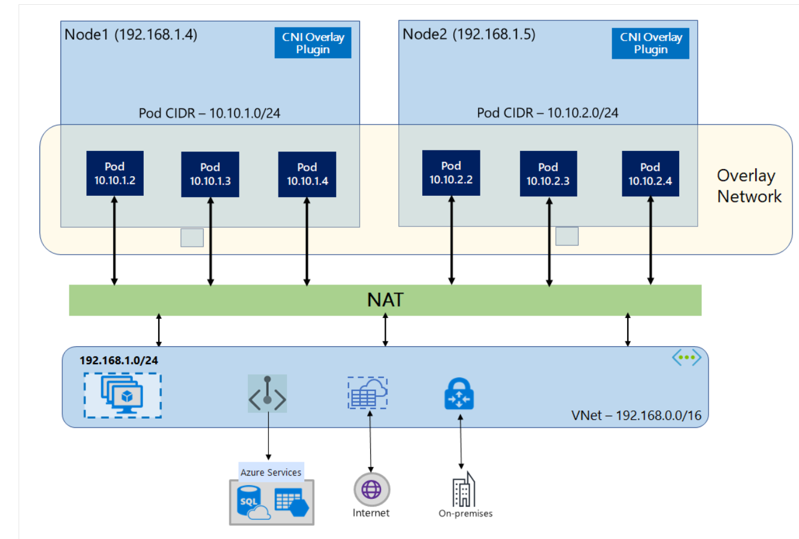
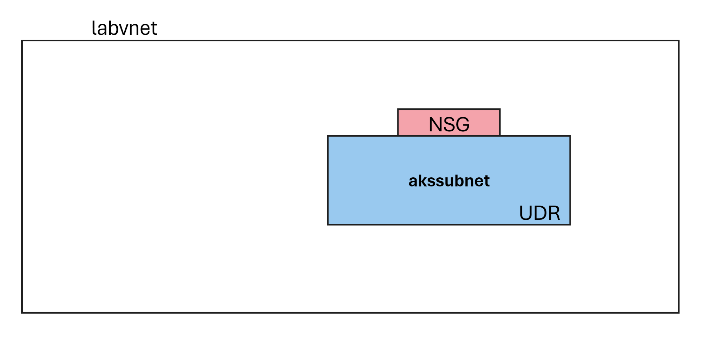
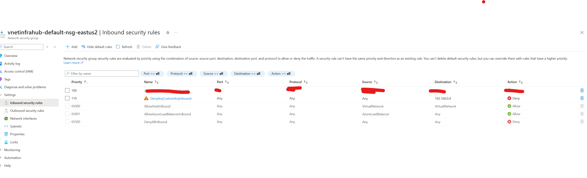
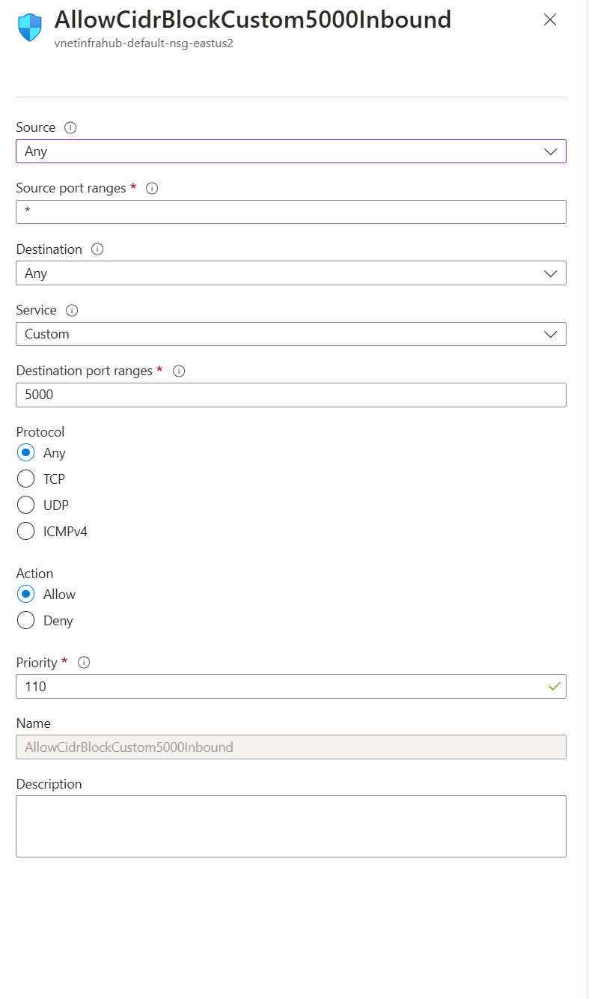
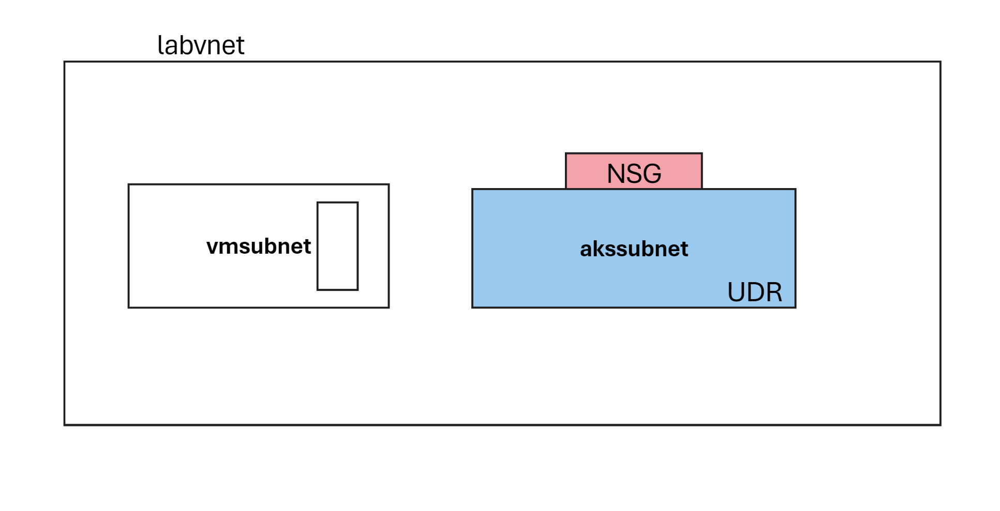

# Lab : AKS Networking  

> Estimated Duration: 60 minutes    


**Note:  Review node resource group (MC_) as you make progress with the lab to understand how AKS manages/configures dependent resources based on Kubernetes deployments/changes.**


##  Exercise: Kubenet with BYO subnet

**Context**  
Create a new AKS cluster with Kubenet networking model.   

**Outcome**   
At the end of this exercise, you should be able to 
- deploy and articulate how kubenet networking works in AKS
- Understand how Kubenet allocates IP addresses
- Understand route tables role in pod networking   
- Understand how node gets its IP address
- Understand hostNetwork and its importance
- Understand how Kubenet model sources IPs for pod and how pod CIDR could be reused for all clusters.   


### Create a new cluster with kubenet networking plugin
```
az group create --name myResourceGroup --location eastus 

az network vnet create --resource-group myResourceGroup --name myAKSVnet --address-prefixes 192.168.0.0/16 --subnet-name myAKSSubnet --subnet-prefix 192.168.1.0/24    

SUBNET_ID=$(az network vnet subnet show --resource-group myResourceGroup --vnet-name myAKSVnet --name myAKSSubnet --query id -o tsv)  

az aks create --resource-group myResourceGroup --name myAKSCluster --network-plugin kubenet     --service-cidr 10.0.0.0/16 --dns-service-ip 10.0.0.10 --pod-cidr 10.244.0.0/16     --docker-bridge-address 172.17.0.1/16 --vnet-subnet-id $SUBNET_ID --node-count 2

az aks get-credentials -n myakscluster -g myresourcegroup --file ~/.kube/config


k cluster-info  
```

Issue following to check node IPs
```
k get node -o wide
```

Let's create a pod and check its IP  

```
k run nginx --image=nginx
k get pod -o wide
```
Pod IP is from pod-cidr specified in aks creation time

Create another pod with this following spec
```
apiVersion: v1
kind: Pod
metadata:
  labels:
    run: nginxh
  name: nginxh
spec:
  containers:
  - image: nginx
    name: nginx
    resources: {}
  dnsPolicy: ClusterFirst
  restartPolicy: Always
  hostNetwork: true
```
k get pod -o wide


What's the IP? why is this different?
Use portal and verify route table. Add a new node and check route table. 
Understand how route table plays a role with Kubenet networking model.


##  Azure CNI Overlay with BYO subnet


**Context**   
At the end of this exercise, 
- you should be able to understand how to deploy VNET with multile subnets
- deploy a cluster with  CNI overlay
- deploy a VM in the same vnet but in a different subnet
- understand how Azure CNI overlay allocates IP addresses for pods and nodes.  



Create a resource group 

```
az group create --name labrg --location eastus2
```

```
az network vnet create --resource-group labrg --name labvnet --address-prefixes 192.168.0.0/16 --subnet-name akssubnet --subnet-prefix 192.168.1.0/24    

SUBNET_ID=$(az network vnet subnet show --resource-group labrg --vnet-name labvnet --name akssubnet --query id -o tsv)  
```


```
az aks create --name labaks2 --resource-group labrg --location eastus2 --network-plugin azure --network-plugin-mode overlay --pod-cidr 10.100.0.0/16 --network-dataplane cilium --vnet-subnet-id $SUBNET_ID  --generate-ssh-keys
```


```
k get all -n kube-system | grep kube
service/kube-dns         ClusterIP   10.0.0.10     <none>        53/UDP,53/TCP   5m17s
```

Compare this to Kubenet or CNI Overlay (without Cilium)
k config use-context aks
Switched to context "aks".

```
k get all -n kube-system | grep kube
pod/kube-proxy-h6kzd                                       1/1     Running   0              116m
pod/kube-proxy-khp8h                                       1/1     Running   0              116m
pod/kube-proxy-rfz4b                                       1/1     Running   0              116m
service/kube-dns                           ClusterIP   10.0.0.10      <none>        53/UDP,53/TCP   47d
daemonset.apps/kube-proxy                        3         3         3       3            3           <none>          47d
```

Kube-proxy is not required in Azure CNI overlay with Cilium.

### SNAT in AKS  
Use echocaller python to check the calling IP address. Understand how SNAT works when the pod is calling external services.   


useful commands 
```
k run netshoot --image=nicolaka/netshoot -- sh -c 'sleep 2000'  

k exec netshoot -it -- bash  

k exec netshoot -it -- curl 192.168.0.132:5000/echo
```


Use Portal to create a VM in the same vnet but in a different subnet.  

SSH to the VM and run echocaller.py. (You may need to install pip and Flask)

Get the private IP address of the VM and use netshoot pod to call the VM. Understand how Azure CNI overlay works with multiple subnets.

k exec netshoot -it -- bash  
(or)
k exec netshoot -it -- curl 192.168.0.4:5000/echo 

192.168.0.4 is the private IP address of the VM. 


## Network Policies  

- Define a NetworkPolicy resource.  
- Set the podSelector to select the pods you want to apply this policy to (e.g., netshoot).
- Define an egress rule to deny traffic to the VM IP (192.168.0.4).


```bash
cat <<EOF | k apply -f -
apiVersion: networking.k8s.io/v1
kind: NetworkPolicy
metadata:
  name: deny-vm-communication
  namespace: default
spec:
  podSelector:
    matchLabels:
      run: netshoot
  policyTypes:
  - Egress
  egress:
  - to:
    - ipBlock:
        cidr: 192.168.0.4/32
EOF
```


k exec netshoot -it -- curl 192.168.0.4:5000/echo  


Implement policy to block all egress traffic except to the VM IP. 

```bash
cat <<EOF | k apply -f -
apiVersion: networking.k8s.io/v1
kind: NetworkPolicy
metadata:
  name: deny-vm-communication
  namespace: default
spec:
  podSelector:
    matchLabels:
      run: netshoot
  policyTypes:
  - Egress
  egress:
  - to:
    - ipBlock:
        cidr: 0.0.0.0/0
        except:
        - 192.168.0.5/32
EOF
```

Use network policies to block communication within the cluster.  


Delete this policy and implement the same in NSG. 



Let's understand how traffic is routed from pods to external resources.  This time, let's try to reach out to a public IP address.  We can use the same VM but let's use a public IP address.

k exec netshoot -it -- curl 48.211.160.49:5000/echo    (use the public IP address of the VM)

Traffic is blocked.  This is the default behavior.  Let's allow this traffic in NSG. 

Add  inbound rule for NSG to allow trafic.  Source IP can be All IP. Understand that this is not a good practice but for testing purposes, we can allow all traffic temporarily.   (image has a specific IP)



Check the caller IP.  It should be the public IP address of the load balancer used by AKS.  This should explain how egress traffic works in AKS.  

